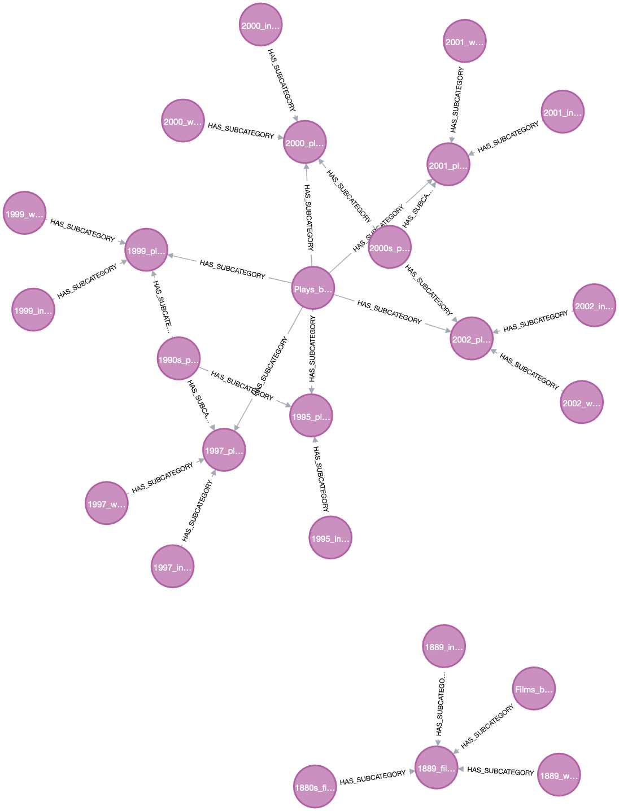

# Wikipedia-Data-Loader---Databases-CourseProject

# Content <!-- omit in toc -->

- [About]("about")
- [Choice of technology](#choice-of-technology)
    - [Database](#database)
    - [Application](#application)
- [Architecture](#architecture)
    - [Components](#components)
    - [Interactions](#interactions)
- [Prerequisites](#prerequisites)
- [Installation and setup instructions](#Installation-and-setup)
    - [Installation](#Instalation)
    - [Setup](#setup)

- [User manual](#user-manual)
- [Design and implementation process](#design and implementation)
  
- [Roles](#roles)
- [Results](#results)
- [Manual how to reproduce the results](#reproduce-results)
- [Self-evaluation](#self-eval)
- [Strategies for future mitigation of identified shortcomings](#strategies)

# About

The aim of our project was to create a database that meets specific requirements. We received a CSV file representing a directed graph, which depicted the main topic classification categories in Wikipedia. Each line of this file represented a single record with two fields indicating the relationship between a category and its subcategory.

We faced a twofold challenge. Firstly, the database was massive - it contained over 2 million nodes and over 5 million relationships. Secondly, the application we were developing had to achieve the following objectives:

The command line utility was to accomplish the following tasks:

1. Finds all children of a given node,
2. Counts all children of a given node,
3. Finds all grand children of a given node,
4. Finds all parents of a given node,
5. Counts all parents of a given node,
6. Finds all grand parents of a given node,
7. Counts how many uniquely named nodes there are,
8. Finds a root node, one which is not a subcategory of any other node,
9. Finds nodes with the most children, there could be more the one,
10. Finds nodes with the least children (number of children is greater than
zero), there could be more the one,
11. Renames a given node,
12. Finds all paths between two given nodes, with directed edges from the first to the second node.

# Choice of technology

### Database

Received file had the structure of a directed graph. After analyzing available options, we concluded that **Neo4j** platform paired with **Cypher** language would be an optimal choice for our project. 

Neo4j delivers unparalleled read and write performance while maintaining robust data integrity. Neo4j is compatible with multiple programming languages. The creators have also ensured clear documentation and even provided free tutorials to get started with the platform.

We opted for the Neo4j Community Version as it offers free access to all system functionalities, making it a cost-effective solution without compromising on performance or features.

### Application

In order to build a transparent application capable of responding to the user's desired queries, we decided to choose **Python**. 
It is the most popular programming language and interacts with Neo4j.


# Architecture

Our project architecture revolves around a Python-based command-line utility named dbcli, designed to interact with a Neo4j graph database. 

### Components

1. **dbcli Command-Line Utility:**

This is the main component of our architecture, responsible for executing various tasks based on user input. It takes a goal number and optional arguments from the user via the terminal.

2. **Python Script**:

The backend of our dbcli utility, written in Python. It contains the logic to parse user inputs, construct Cypher queries, and interact with the Neo4j database.

3. **Neo4j Database:**

The database platform storing the directed graph data. It holds the Wikipedia main topics classification categories and their relationships. All of the data are stored as nodes and relations between them, in our case in form (Title)-[HAS_SUBCATEGORY]->(Title)
The following picture represents the structure of out database.


### Interactions:

- **User Interaction:**

    - The user runs the dbcli utility in the terminal with a goal number and optional arguments.
    - Example: dbcli 1 "1880s_films"

- **dbcli Interaction with Python Script:**

    - The dbcli utility passes the goal number and arguments to the Python script.
    - The Python script choses the corresponding Cypher query based on the goal number and executes it against the Neo4j database.

- **Python Script Interaction with Neo4j Database:**

    - The Python script connects to the Neo4j database using appropriate credentials.
    - It executes the Cypher query to perform operations like finding children, counting nodes, or retrieving node information.
    - The results from the database are fetched by the Python script and displayed back to the user via the terminal.

This architecture ensures a clear separation of concerns, with the dbcli utility handling user interactions, the Python script managing the backend logic and database interactions, and Neo4j serving as the data storage and retrieval engine. This setup enables efficient execution of tasks, seamless user experience, and robust interaction with the graph database.


# Prerequisites

To run our dbcli command-line utility and interact with the Neo4j database, the following prerequisites must be met:

**1. Unix system**

Unix allows direct communication with the computer via a terminal, hence being very interactive and giving the user direct control over the computer resources. What is more Neo4j works better with Linux/MacOs.

If you use Windows, we recommend installing Virtual Machine.

**2. Python:**

Version: Python version >=3.7 

Purpose: Required to execute the dbcli utility and Python script that interacts with the Neo4j database.

**3. Neo4j Database:**

Version: Neo4j Community Version

Purpose: The database platform where the Wikipedia main topics classification categories and their relationships are stored.

**4. Neo4j Python Driver:**

Purpose: A Python library that allows the Python script to connect to and interact with the Neo4j database.


**5. dbcli Command-Line Utility:**

Purpose: The main utility that executes tasks based on user input.


**6. Cypher Language Knowledge:**

Purpose: Basic understanding of Cypher queries to modify or extend the functionality of the dbcli utility if needed.


By ensuring that these prerequisites are met, users will be able to successfully run and interact with the dbcli utility, execute Cypher queries against the Neo4j database, and achieve the desired tasks outlined in the project goals.

# Installation and setup information

Before attempting to installation, it is good habit to update and upgrade your system:

Linux:
```
sudo apt update
sudo apt upgrade
```

### Installation
1. Install Python 3.x >= 3.7 from the official [Python website](https://www.python.org/downloads/) or package manager. Choose appropriate version for your system. 
  - make sure you have `pip` installed - if note do that with following command 
  
Linux:
  ```
  sudo apt-get install python3-pip
  ```
  MacOs:
  ```
  python3 -m ensurepip

  ```
2. Download and install Neo4j Community Version from the [Neo4j website](https://neo4j.com/deployment-center/?ref=subscription#community):
- In section 'Graph Database Self-Managed' select 'Community Edition'.
- Choose right package for your system and click 'Download'.
- On the page where you see the options for 'Self Managed', select the 'Community' version. In the second drop-down menu, select 'Linux/Mac Executable File'.
-  Once selected, click the 'Download' button and follow the steps from instruction.
After the installation is completed, you should have NEO4J_HOME folder with all necessary configuration files on your computer.

A full installation will require connecting to neo4j using a login and temporary password. For each new user, these are in both fields `neo4j`. The first time you connect, the system will ask you to change the password. 

**NOTE** - remember this password, you will need it for later work with the database.

3. Install the Neo4j Python driver using pip.
```python
pip install neo4j
```

### Setup
**1. Clone or download the  repository from GitHub.**
```
git clone https://gitlab.kis.agh.edu.pl/databases-2-2024/db2-15-martyna-baran-zuzanna-jarlaczynska.git

```

Use ssh if you prefer.
```
git clone ssh://git@gitlab.kis.agh.edu.pl:2222/databases-2-2024/db2-15-martyna-baran-zuzanna-jarlaczynska.git
```

**2. Run neo4j localhost in your browser**

To run your localhost of neo4j server, follow this steps:
- Open terminal and navigate to your NEO4J_HOME folder:

```
cd NEO4J_HOME
```
- Connect to the neo4j server by typing in your terminal:
```
./bin/neo4j-admin server console
```

Now you should have the following neo4j localhost window opened in your browser: 


**3. Alias the dbcli file**

To be able tu run program from terminal as `dbcli` with additional arguments, follow below steps.

Open terminal and in home write:
```
vim ~/.bash_profile
```
This will open vim editor in given file where you need to add alias at the end:
```
alias dbcli='python dbcli.py'
```
Then you have to source the changes:
```
source ~/.bash_profile
```

**NOTE** 
Last command `source ~/.bash_profile` will need to be typed everytime you start new terminal.


**4. Fill user data**

Navigate to the dbcli directory and open `dbcli.py` in your IDE to see the code. Here insert your data into arrtibutes:
```py
uri=""
username=""
password=""
```

Here is where you will use the password you set in the previous chapter. You can find username and uri by typing:
```
:server status
```
in neo4j command line in your browser .

**5. Load the database**

- Put taxonomy_iw.csv file in NEO4J_HOME/import folder 
- Run the following commands in your terminal:
```
dbcli 0
dbcli 13
```
Be patient, loading may take a few minutes.

# User manual

After performing all installation and setup, you can turn to working with application.

To run the software, knowledge from earlier steps will be useful. 
1. Choose which query you would like to run - remember the number of the query.
2. Open terminal.
3. Type `dbcli [query_number] [arguments]` and fill in the [] with your data.

# Design and implementation process

**Stage 1 - Gaining knowledge of graph databases, the technologies used in this field and the resources available.**

Preparing to get started required deepening our knowledge of graph databases. The data structure we were dealing with suggested that these technologies were more suitable than traditional relational databases. In order to work effectively, we needed to understand how graph databases work and what their characteristics are. 

**Stage 2 - Review of technologies used in the field of graph databases and evaluation of available resources**.


We conducted thorough research in search of the technology that best suited our expectations. The criteria we considered were:
- easy and widespread availability on various systems,
- free use of the system,
- efficiency when handling large data sets,
- availability of knowledge resources - whether there is sufficient information on how to use the platform and programming language,
- opinions and experiences of other programmers on forums.
After considering all the available options, we chose the Neo4j platform that best met our criteria. At the same time, we decided that the implementation of the code would be carried out in Python, which is compatible with the chosen platform and is very popular among programmers.


**Stage 3 - Plan for loading data into the database and handling goals.**


Due to the large size of the database, we decided to use indexes for each node. This way, the system checks whether a given Node with a given name already exists in the database, which eliminates the need for repeated loading. In this situation, we only add relationships.
We made this decision based on our own experience. Trying to load data without indexes was unsuccessful and could take up to a dozen days. After using indexes, the whole process took only a dozen minutes.

Regarding the structure of the base, we decided on a simple model:
- each node has a type 'Title',
- relations between nodes we named 'HAS_SUBCATEGORY'.

Such a decision arose from an analysis of the program's goals. We realized that we didn't need additional attributes for the nodes, and we could easily obtain any additional information using queries.

**Stage 4 - Preparation of queries that implement the project goals**

Before we started programming in the final format (Python language, we decided to prepare queries corresponding to each of the established goals. These queries were then tested directly in the Neo4j application console. This allowed us to make sure that the proposed formulas work properly and perform their tasks efficiently. Testing in a real-world environment also allowed us to assess whether the database was running at optimal speed.

**Stage 5 - Coding in Python**
After preparing the queries, it was time to implement them in Python. Connecting to the database using Python is very easy, but it requires the user to fill in his own data in the fields:
```
uri=""
login""
password=""
```
In order to implement the queries we decided to use a simple dictionary structure. The key in this dictionary is the number of the quest, and the value is the content of the quest. We devoted a large part of the code to developing how to present the results on the screen. We wanted the user to be able to understand the query results easily and clearly. We introduced various functions and text formatting to clearly display the information, as well as additional features such as pagination and sorting to help navigate and analyze the results. As a result, the presentation of data is not only effective, but also user-friendly.

**Stage 6 - Making the program work as `dbcli` utility**

The project required us to be able to execute all goals from the terminal after entering the formula:
`dbcli [task number] [possible arguments]`.
In Unix systems this can be solved by adding an alias to the bash file - the exact process is described in the [Installation and setup instructions](#Installation-and-setup) chapter.

**Stage 7 - Final Troubleshooting**
During the course of a project as complex as ours, some complications can unfortunately arise. Fortunately, we were prepared for such an eventuality and successfully dealt with the challenges we encountered. Here are some of the problems we encountered and how we solved them:
- At the very beggining we found loading the data quite tricky. The size of the file made it impossible to load without using index. However, after creating the proper index on 'name' property, we managed to load the database really quick.
- Another problem we encountered was the dbcli tool not working. Although our queries were correct (tested directly in the Neo4j terminal), the utility did not want to work. We managed to find a solution to this problem by adding an alias and configuring the source file accordingly.
- The last challenge was the inoperability of query 12. The path set by Neo4j was not displayed correctly. Finally, we learned that using .data() property of the record/path returns a dictionary with all values. In this way we could extract exactly the data that we needed and print them in terminal.

Thanks to our determination and ability to quickly diagnose the problems, we were able to successfully solve them and continue working on the project.

**Stage 8 - Writing documentation**

Last, but not least was writing a proper documentation. It is really important part of the work as it state a clear documenation about the process, making it possible to see ups and wons. What is even more important it shares a propoer source of knowledge and enables people reproduce your results.

# Roles
Both:
- Research, discussion and making choice about technologies used.
- Preparing architerture of the application 
- Writing queries to fulfil goals

Zuzanna:
- Putting written queries in python file

Martyna:
- Preparing documentation

# Results

For each goal we prepared example of answer to executed query. You can compare your results to see if everything works fine.

1. dbcli 1 "19th-century_films"

Executed query: MATCH (c:Title{name: "19th-century_films"})-[:HAS_SUBCATEGORY]->(s) RETURN s;

Query result:

19th-century_directorial_debut_films
19th-century_science_fiction_films
19th-century_animated_films
19th-century_Christmas_films
19th-century_sports_films
19th-century_crime_films
19th-century_speculative_fiction_films
19th-century_romance_films
19th-century_supernatural_films
19th-century_documentary_films
19th-century_Western_(genre)_films
19th-century_ghost_films
19th-century_comedy_films
19th-century_dance_films
19th-century_drama_films
19th-century_lost_films
19th-century_short_films
19th-century_war_films
1890s_films
1880s_films
1870s_films

Execution time: 0.12985491752624512

2. dbcli 2 "19th-century_films"

Executed query: MATCH (c:Title {name: "19th-century_films"})-[r:HAS_SUBCATEGORY]->(s:Title) RETURN count(r) As numberOfChildren

Query result:

{'numberOfChildren': 21}

Execution time: 0.146881103515625

3. dbcli 3 "19th-century_films"

Executed query: MATCH (c:Title {name: "19th-century_films"})-[:HAS_SUBCATEGORY]-{2}(s:Title) RETURN DISTINCT s

Query result:

Directorial_debut_films_by_century
19th-century_debut_works
1890s_directorial_debut_films
1880s_directorial_debut_films
1870s_directorial_debut_films
1890s_science_fiction_films
19th-century_science_fiction_works
19th-century_speculative_fiction_films
Science_fiction_films_by_century
19th-century_science_fiction_comedy_films
Animated_films_by_century
19th_century_in_animation
1890s_animated_films
19th-century_animated_short_films
1890s_Christmas_films
19th-century_Christianity
Christmas_films_by_century
1890s_sports_films
Sports_films_by_century
19th_century_in_sports
Crime_films_by_century
1890s_crime_films
19th-century_science_fiction_films
1890s_speculative_fiction_films
Speculative_fiction_films_by_century
19th-century_horror_films
19th-century_romantic_comedy_films
1890s_romance_films
Romance_films_by_century
1890s_supernatural_films
Supernatural_films_by_century
19th-century_short_documentary_films
1890s_documentary_films
Documentary_films_by_century
Pre-1910_Western_(genre)_films
Western_(genre)_films_by_century
1890s_ghost_films
Ghost_films_by_century
1890s_comedy_films
19th-century_comedy-drama_films
Comedy_films_by_century
1890s_dance_films
1880s_dance_films
Dance_films_by_century
1890s_drama_films
Drama_films_by_century
1880s_lost_films
1890s_lost_films
Lost_films_by_century
Short_films_by_century
1890s_short_films
1890s_war_films
War_films_by_century
19th-century_architecture
19th-century_Christian_texts
Buildings_and_structures_completed_in_the_19th_century
19th-century_treaties
19th-century_comics
19th-century_inscriptions
19th-century_literature
19th-century_sculptures
19th-century_compositions
19th-century_ballet_premieres
19th-century_murals
19th_century
Works_by_century
19th_century_in_the_arts
2nd-millennium_works
19th-century_short_story_collections
19th-century_documents
19th-century_plays
19th_century_in_music
19th-century_paintings
19th-century_drawings
19th-century_dance
19th_century_in_art
19th-century_short_stories
19th-century_essays
19th-century_ballads
19th-century_photographs
19th-century_operas
19th-century_clothing
19th-century_speeches
19th-century_musicals
19th-century_maps_and_globes
19th-century_prints
19th-century_poems
1900_works
19th-century_publications
1830s_works
1840s_works
1800s_works
1880s_works
1820s_works
1860s_works
1890s_works
1810s_works
1850s_works
1870s_works
19th_century_in_American_cinema
19th_century_in_British_cinema
Films_set_in_the_19th_century
1870s_in_film
1890s_in_film
1880s_in_film
Film_by_century
19th_century_in_mass_media
Television_films_by_century
Works_by_type_and_century
Product_introductions_by_century
Films_by_date
Spy_comedy_films_by_century
Musical_films_by_century
Action_horror_films_by_century
Action_films_by_century
Fantasy_films_by_century
Serial_killer_films_by_century
Biographical_films_by_century
21st-century_films
20th-century_films
Pregnancy_films_by_century
Slasher_films_by_century
Avant-garde_and_experimental_films_by_century
LGBT-related_films_by_century
Satirical_films_by_century
Teen_films_by_century
Thriller_films_by_century
Feminist_films_by_century
Mystery_films_by_century
Spy_films_by_century
1890s_Japanese_films
1890s_pornographic_films
Lists_of_1890s_films
1890s_rediscovered_films
Films_by_decade
1890_films
1898_films
1892_films
1891_films
1893_films
1897_films
1895_films
1894_films
1896_films
1899_films
Lists_of_1880s_films
1887_films
1888_films
1889_films
1874_films
1878_films

Execution time: 0.2840907573699951

4. dbcli 4 "1880s_dance_films"

Executed query: MATCH (c:Title)-[:HAS_SUBCATEGORY]->(s:Title{name: "1880s_dance_films"}) RETURN c

Query result:

1880s_films
Dance_films_by_decade
19th-century_dance_films

Execution time: 0.030778884887695312


5. dbcli 5 "1880s_dance_films"

Executed query: MATCH (c:Title)-[r:HAS_SUBCATEGORY]->(s:Title {name: "1880s_dance_films"}) RETURN count(r) As numberOfParents

Query result:

{'numberOfParents': 3}

Execution time: 0.11403989791870117

6. dbcli 6 "1880s_dance_films"

Executed query: MATCH (c:Title)-[:HAS_SUBCATEGORY]-{2}(s:Title{name: "1880s_dance_films"}) RETURN DISTINCT c

Query result:

1880s_lost_films
Lists_of_1880s_films
19th-century_films
1880s_works
Films_by_decade
1880s_in_film
1880s_directorial_debut_films
1887_films
1888_films
1889_films
1940s_dance_films
1890s_dance_films
1910s_dance_films
1930s_dance_films
1920s_dance_films
2020s_dance_films
1950s_dance_films
1900s_dance_films
1980s_dance_films
1970s_dance_films
2010s_dance_films
1960s_dance_films
1990s_dance_films
2000s_dance_films
Hip_hop_films_by_decade
Dance_films
Dance_films_by_century

Execution time: 0.2069532871246338

7. dbcli 7

Executed query: MATCH (c:Title) RETURN count(c) as totalNum

Query result:
{'totalNum': 2031337}

Execution time: 0.045433998107910156

8. dbcli 8

Executed query: MATCH (c:Title) WHERE NOT EXISTS( ()-[:HAS_SUBCATEGORY]->(c:Title)) Return c as RootNodes

Query result:

{'name': 'LOMO'}
{'name': 'Phish'}
{'name': 'Agnes_(singer)'}
{'name': 'Theatre_of_Tragedy'}
{'name': 'Steeleye_Span'}
{'name': 'Indigo_Girls'}
{'name': 'Lady_Gaga'}
{'name': 'God_Lives_Underwater'}
{'name': 'SNH48'}
{'name': 'Dana_International'}
{'name': 'Yo_Yo_Honey_Singh'}
{'name': 'Markus_Feehily'}
{'name': 'Sechs_Kies'}
{'name': 'Daniela_Mercury'}
{'name': 'Pristin'}
{'name': 'Poppy_(entertainer)'}
{'name': 'Herbie_Hancock'}
{'name': 'Crazy_Horse_(band)'}
{'name': 'Melendi'}
{'name': 'Oh_My_Girl'}
{'name': 'Omega_Tribe_(Japanese_band)'}
{'name': 'Amy_Lee'}
{'name': 'Mamamoo'}
{'name': 'Weki_Meki'}
{'name': 'Die_Antwoord'}
{'name': 'Slza'}
{'name': 'Earphones_(band)'}
{'name': 'Big_Red_Machine_(band)'}
{'name': 'STAYC'}
{'name': 'Viviz'}
{'name': 'Le_Sserafim'}
{'name': 'Hard-Fi'}
{'name': 'Contents'}
{'name': 'The_Monks'}
{'name': 'Five_Star'}
{'name': 'Lacuna_Coil'}
{'name': 'Father/Daughter_Records'}
{'name': 'Sanai'}
{'name': 'Humayun_Azad'}
{'name': 'Mor_ve_Ötesi'}
{'name': 'Aaron_Carter'}
{'name': 'Shirō_Sagisu'}
{'name': 'Dannii_Minogue'}
{'name': 'Greyson_Chance'}
{'name': 'Michael_Bublé'}
{'name': 'Sholem_Aleichem'}
{'name': 'Blanco_(singer)'}
{'name': 'HMS_Nile_(1839)'}
{'name': 'R.E.M.'}
{'name': 'Darius_Campbell'}
{'name': 'George_Gershwin'}
{'name': 'Usher_(musician)'}
{'name': 'Miranda_Cosgrove'}
{'name': 'Bonnie_and_Clyde'}
{'name': 'Co-op_(Wikipedia)'}
{'name': 'Wikipedia_deletion'}
{'name': 'Hilda_Annetta_Walker'}
{'name': 'Another_Level_(band)'}
{'name': 'Nick_Carter_(musician)'}
{'name': 'Jamia_Uloom-ul-Islamia'}
{'name': 'Duke_Ellington'}
{'name': 'Miss_A'}
{'name': 'Simcoe_County_Rovers_FC'}
{'name': 'Buckethead'}
{'name': 'KC_and_the_Sunshine_Band'}
{'name': 'Zabranjeno_pušenje'}
{'name': 'The_Moffatts'}
{'name': 'Sweetbox'}
{'name': 'Emma_Thompson'}
{'name': 'Wikipedia_basic_information'}
{'name': 'Aaron_Copland'}
{'name': 'Wink_(duo)'}
{'name': 'Ayaka'}
{'name': 'Momoiro_Clover_Z'}
{'name': "Ladies'_Code"}
{'name': 'The_Peddlers'}
{'name': 'Bono'}
{'name': 'Hepsi'}
{'name': 'Conor_Oberst'}
{'name': 'Leonard_Bernstein'}
{'name': 'Ocean_Colour_Scene'}
{'name': 'Doris_Day'}
{'name': 'Misia'}
{'name': 'Ua_(singer)'}
{'name': 'Wikipedia_featured_list_candidates'}
{'name': 'Drake_Bell'}
{'name': 'Pearl_Jam'}
{'name': 'Beyond_(band)'}
{'name': 'Jane_Zhang'}
{'name': 'Alan_Walker_(music_producer)'}
{'name': 'Emma_Louise'}
{'name': 'Carole_King'}
{'name': 'Legião_Urbana'}
{'name': 'Junoon_(band)'}
{'name': 'Jedward'}
{'name': 'Cocteau_Twins'}
{'name': 'Kimbra'}
{'name': 'Strings_(band)'}
{'name': 'Warrant_(American_band)'}
{'name': 'Katie_Price'}
{'name': 'Little_Mix'}
{'name': 'Lukas_Graham'}
{'name': 'Shane_Filan'}
{'name': 'Jennifer_Rush'}
{'name': 'Ali_Zafar'}
{'name': 'Édith_Piaf'}
{'name': 'No_Angels'}
{'name': 'Serebro'}
{'name': 'David_Byrne'}
{'name': 'Switchfoot'}
{'name': 'Timbiriche'}
{'name': 'Steelheart'}
{'name': 'Idina_Menzel'}
{'name': 'Los_Hermanos'}
{'name': 'Migos'}
{'name': 'Kim_Hee-chul'}
{'name': 'DNCE'}
{'name': 'Hugh_Jackman'}
{'name': 'Liberty_X'}
{'name': 'Il_Divo'}
{'name': 'Brother_Beyond'}
{'name': 'Anita_Bryant'}
{'name': 'The_Flying_Pickets'}
{'name': 'Tamar_Braxton'}
{'name': 'Sonic_Youth'}
{'name': 'NSYNC'}
{'name': 'Wild_Orchid_(group)'}
{'name': 'Yo_La_Tengo'}
{'name': 'Demis_Roussos'}
{'name': 'Lepa_Brena'}
{'name': 'Cannibal_Corpse'}
{'name': 'Backstreet_Boys'}
{'name': 'Refused'}
{'name': 'Small_Faces'}
{'name': 'Cardiacs'}
{'name': 'Marina_Diamandis'}
{'name': 'Luna_Sea'}
{'name': 'Zendaya'}
{'name': 'Buck-Tick'}
{'name': 'Fifth_Harmony'}
{'name': 'Pentatonix'}
{'name': 'One_Ok_Rock'}
{'name': 'We_Are_the_Fallen'}
{'name': 'Bradley_Cooper'}
{'name': 'Puffy_AmiYumi'}
{'name': 'The_Chemical_Brothers'}
{'name': 'James_Brown'}
{'name': 'Wanessa_Camargo'}
{'name': 'Hide_(musician)'}
{'name': 'Yuki_Kajiura'}
{'name': 'Big_Thief'}
{'name': 'Svetlana_Loboda'}
{'name': 'Verka_Serduchka'}
{'name': 'Wikipedia_templates_by_location'}
{'name': 'Village_People'}
{'name': 'David_Hasselhoff'}
{'name': 'Victoria_Justice'}
{'name': 'Wim_Wenders'}
{'name': 'Kollegah'}
{'name': 'Infobox_road_instances_by_country'}
{'name': 'Ninja_Tune'}
{'name': 'Butthole_Surfers'}
{'name': 'Tokio_Hotel'}
{'name': 'Madlib'}
{'name': 'Animal_Collective'}
{'name': 'Lady_Sovereign'}
{'name': 'Tyga'}
{'name': 'Doghouse_Records'}
{'name': 'Wir_sind_Helden'}
{'name': 'Titanium_(band)'}
{'name': 'Shironamhin'}
{'name': 'Lorde'}
{'name': '6ix9ine'}
{'name': 'Nelly'}
{'name': 'Sneaky_Sound_System'}
{'name': 'Wikipedia_interface_help'}
{'name': 'Macklemore'}
{'name': 'Common_(rapper)'}
{'name': 'Rich_Homie_Quan'}
{'name': 'Béla_Fleck'}
{'name': 'Earl_Sweatshirt'}
{'name': 'Cosocomo'}
{'name': 'G.o.d'}
{'name': 'Kyle_(musician)'}
{'name': 'Chance_the_Rapper'}
{'name': 'JO1'}
{'name': 'Yungblud'}
{'name': 'Lawrence_Welk'}
{'name': 'Dirty_Hit'}
{'name': 'Defiance_Records'}
{'name': 'Trustkill_Records'}
{'name': 'Badfinger'}
{'name': 'Social_Distortion'}
{'name': 'Billy_Talent'}
{'name': 'Boyzone'}
{'name': 'Descendents'}
{'name': 'Awaz'}
{'name': 'Cursive_(band)'}
{'name': 'Captain_Beefheart'}
{'name': 'Hanson_(band)'}
{'name': 'Nima_Yooshij'}
{'name': 'Undecided_Records'}
{'name': 'Shield_Recordings'}
{'name': 'British_Sea_Power'}
{'name': 'Goldfrapp'}
{'name': 'Wikipedia_cleanup_by_subject'}
{'name': 'Meat_Loaf'}
{'name': 'Crowded_House'}
{'name': 'April_Wine'}
{'name': 'White_Lies_(band)'}
{'name': 'Big_Star'}
{'name': 'Helix_(band)'}
{'name': 'Allie_X'}
{'name': 'Australian_Crawl'}
{'name': 'Mercury_Rev'}
{'name': 'They_Might_Be_Giants'}
{'name': 'Diplo'}
{'name': 'Throwing_Muses'}
{'name': 'Moby'}
{'name': 'Equal_Vision_Records'}
{'name': 'Kreator'}
{'name': 'Kool_&_the_Gang'}
{'name': 'Take_That'}
{'name': 'Dropkick_Murphys'}
{'name': 'Rammstein'}
{'name': 'Good_Life_Recordings'}
{'name': 'Shalamar'}
{'name': 'D-Block_Records'}
{'name': 'Mika_Waltari'}
{'name': 'Maroon_5'}
{'name': "Noel_Gallagher's_High_Flying_Birds"}
{'name': 'AKA_(rapper)'}
{'name': 'David_Gray_(musician)'}
{'name': 'Sam_Raimi'}
{'name': 'Enya'}
{'name': 'Eiffel_65'}
{'name': 'Restless_Heart'}
{'name': 'Frantz_Fanon'}
{'name': 'McFly'}
{'name': 'R._Kelly'}
{'name': 'Deee-Lite'}
{'name': 'Insomnium'}
{'name': 'Kavad_II'}
{'name': 'Wikipedia_requests'}
{'name': 'Bad_Brains'}
{'name': 'Daft_Punk'}
{'name': 'Wikipedia_spam'}
{'name': 'Juanes'}
{'name': '911_(English_group)'}
{'name': 'Weezer'}
{'name': 'Dal_Shabet'}
{'name': 'Wikipedia_templates_by_task'}
{'name': 'Deepspace5'}
{'name': 'International_Federation_of_Muaythai_Associations'}
{'name': '311_(band)'}
{'name': 'Novak_Djokovic'}
{'name': "Finneas_O'Connell"}
{'name': 'Roberto_Rossellini'}
{'name': 'I_Am_Kloot'}
{'name': 'Shakira'}
{'name': 'Eels_(band)'}
{'name': 'Ramones'}
{'name': 'Cold_Chisel'}
{'name': 'Dream_(American_group)'}
{'name': 'XTC'}
{'name': 'Mina_(Italian_singer)'}
{'name': 'OneRepublic'}
{'name': 'Run-DMC'}
{'name': 'Wall_of_Voodoo'}
{'name': 'Zhou_Shen'}
{'name': 'Akon'}
{'name': 'Linkin_Park'}
{'name': 'Meat_Puppets'}
{'name': 'Hoodoo_Gurus'}
{'name': 'Lumidee'}
{'name': 'Dire_Straits'}
{'name': 'Eyes_of_Eden'}
{'name': 'MC_Hammer'}
{'name': '112_(band)'}
{'name': 'K._Michelle'}
{'name': 'Orson_Welles'}
{'name': 'Hello_Venus'}
{'name': 'Oliver_Farm_Equipment_Company'}
{'name': 'TISM'}
{'name': 'Cheryl_(singer)'}
{'name': 'Travis_(band)'}
{'name': 'Kaiser_Chiefs'}
{'name': 'Steps_(group)'}
{'name': 'Ivy_Queen'}
{'name': "Blazin'_Squad"}
{'name': 'KSI'}
{'name': 'Momoland'}
{'name': 'Mahammad_Amin_Rasulzade'}
{'name': 'Thompson_Twins'}
{'name': 'Silverchair'}
{'name': 'C._J._Cherryh'}
{'name': 'Jaga_Jazzist'}
{'name': 'NOFX'}
{'name': 'David_Bowie'}
{'name': 'Rafael_Nadal'}
{'name': 'Railway_stations_in_Denmark_by_year_of_opening'}
{'name': 'Railway_stations_in_Ireland_by_year_of_opening'}
{'name': 'Railway_stations_in_Belgium_by_year_of_opening'}
{'name': 'Railway_stations_in_Northern_Ireland_by_year_of_opening'}
{'name': 'Railway_stations_in_the_Czech_Republic_by_year_of_opening'}
{'name': 'Railway_stations_in_the_Netherlands_by_year_of_opening'}
{'name': 'Railway_stations_in_Italy_by_year_of_opening'}
{'name': 'Railway_stations_in_Poland_by_year_of_opening'}
{'name': 'Railway_stations_in_Slovenia_by_year_of_opening'}
{'name': 'Wikipedia_placeholders'}
{'name': 'Leona_Lewis'}
{'name': 'Kiss_(band)'}
{'name': 'M-Flo'}
{'name': 'KMFDM'}
{'name': 'Traffic_(band)'}
{'name': 'Count_Basie'}
{'name': 'Gru_(rapper)'}
{'name': 'Lady_A'}
{'name': 'Mission_of_Burma'}
{'name': 'Discipline_Global_Mobile'}
{'name': 'Son_of_Dork'}
{'name': "D'banj"}
{'name': 'Imagine_Dragons'}
{'name': 'Everclear_(band)'}
{'name': 'Catfish_and_the_Bottlemen'}
{'name': 'The_Lonely_Island'}
{'name': 'Leonardo_DiCaprio'}
{'name': 'Lil_Nas_X'}
{'name': 'BGYO'}
{'name': 'Religious_buildings_and_structures_disambiguation_pages'}
{'name': 'Edward_W._Hardy'}
{'name': 'Enhypen'}
{'name': 'Good_Charlotte'}
{'name': 'People_from_New_England'}
{'name': 'Fall_Out_Boy'}
{'name': 'Apoptygma_Berzerk'}
{'name': 'Maná'}
{'name': 'Little_River_Band'}
{'name': 'X_(American_band)'}
{'name': 'London_Symphony_Orchestra'}
{'name': 'Goldfinger_(band)'}
{'name': 'Grateful_Dead'}
{'name': 'Pet_Shop_Boys'}
{'name': 'Mötley_Crüe'}
{'name': 'Avicii'}
{'name': 'Rip_Rig_+_Panic'}
{'name': 'ZZ_Top'}
{'name': 'Rihanna'}
{'name': 'The_Motors'}
{'name': 'Shila_Amzah'}
{'name': 'Beastie_Boys'}
{'name': 'Logic_(rapper)'}
{'name': 'Steely_Dan'}
{'name': 'Cardi_B'}
{'name': 'Robyn'}
{'name': 'Kelis'}
{'name': 'Tove_Lo'}
{'name': 'Morrissey'}
{'name': 'Jack_Dempsey'}
{'name': 'Joe_Louis'}
{'name': 'Olivia_Rodrigo'}
{'name': 'Pope_Pius_VI'}
{'name': 'Mogwai'}
{'name': 'Front_242'}
{'name': 'Sam_the_Kid'}
{'name': 'Muslimgauze'}
{'name': 'Plasmatics'}
{'name': 'Powerwolf'}
{'name': 'Incubus_(band)'}
{'name': 'Inna'}
{'name': 'HIM_(Finnish_band)'}
{'name': 'CNBLUE'}
{'name': 'MBLAQ'}
{'name': 'Shankar–Ehsaan–Loy'}
{'name': 'Beyoncé'}
{'name': 'Tori_Amos'}
{'name': 'Kino_(band)'}
{'name': 'Princess_Princess_(band)'}
{'name': 'Sonata_Arctica'}
{'name': 'Anna_Vissi'}
{'name': 'T.A.T.u.'}
{'name': 'Super_Furry_Animals'}
{'name': 'Dark_Funeral'}
{'name': 'Flowing_Tears'}
{'name': 'New_Kids_on_the_Block'}
{'name': 'Muse_(band)'}
{'name': 'Peter_Andre'}
{'name': 'The_Doors'}
{'name': 'The_Clash'}
{'name': 'The_Kinks'}
{'name': 'Nick_Drake'}
{'name': 'Louis_Armstrong'}
{'name': 'Angelique_Kerber'}
{'name': 'Blue_(English_band)'}
{'name': 'XFL_(2001)_templates'}
{'name': 'Golden_Ticket_Awards'}
{'name': 'Pope_Urban_VIII'}
{'name': 'Manowar'}
{'name': 'Katy_Garbi'}
{'name': 'Wikipedia_editor_help'}
{'name': 'Yuki_Saito_(actress)'}
{'name': 'New_Order_(band)'}
{'name': 'R5_(band)'}
{'name': 'Rush_(band)'}
{'name': 'Bill_Drummond'}
{'name': 'Comic_character_redirects_to_lists'}
{'name': 'Language_templates_errors'}
{'name': 'Metallica'}
{'name': 'B*Witched'}
{'name': 'My_Chemical_Romance'}
{'name': 'Taxiride'}
{'name': 'The_Kingsmen'}
{'name': 'Vanessa_Hudgens'}
{'name': 'Leessang'}
{'name': 'Love_and_Death_(band)'}
{'name': 'Levon_Helm'}
{'name': 'Ivor_Novello'}
{'name': 'Fats_Domino'}
{'name': 'Sleeper_(band)'}
{'name': 'MNEK'}
{'name': 'Johann_Gottfried_Herder'}
{'name': 'Carlos_Santana'}
{'name': 'Pope_Clement_X'}
{'name': 'Bill_Maher'}
{'name': 'The_Shamen'}
{'name': 'Stereophonics'}
{'name': 'Simon_Webbe'}
{'name': 'Despina_Vandi'}
{'name': 'The_Troggs'}
{'name': 'Firewind'}
{'name': 'Manic_Street_Preachers'}
{'name': 'Earth,_Wind_&_Fire'}
{'name': 'The_Cars'}
{'name': 'Danzig_(band)'}
{'name': 'Victoria_Azarenka'}
{'name': 'Falling_in_Reverse'}
{'name': 'Jordin_Sparks'}
{'name': 'Atlanta_Rhythm_Section'}
{'name': 'Ahlulbayt_TV'}
{'name': 'Yōko_Oginome'}
{'name': 'George_Sand'}
{'name': 'Pope_Clement_XI'}
{'name': 'Pope_Clement_IX'}
{'name': 'Skindred'}
{'name': 'The_Blue_Hearts'}
{'name': 'Sex_Pistols'}
{'name': '10cc'}
{'name': 'Sade_(band)'}
{'name': 'Adele'}
{'name': 'Ivi_Adamou'}
{'name': 'Hunters_&_Collectors'}
{'name': 'Pope_Clement_XII'}
{'name': 'The_Move'}
{'name': 'BeForU'}
{'name': 'Depeche_Mode'}
{'name': 'Sugababes'}
{'name': 'Meshuggah'}
{'name': 'Fitz_and_The_Tantrums'}
{'name': 'Phil_Ochs'}
{'name': 'Tom_Waits'}
{'name': 'Sam_Cooke'}
{'name': 'WarCry_(band)'}
{'name': 'Beth_Ditto'}
{'name': 'Siti_Nurhaliza'}
{'name': 'Pope_Clement_XIV'}
{'name': 'Elton_John'}
{'name': 'Kids_United'}
{'name': 'Jonah_Hill'}
{'name': 'Dave_Grohl'}
{'name': 'Tig_Notaro'}
{'name': 'Train_(band)'}
{'name': 'Kid_Cudi'}
{'name': 'Bruno_Schulz'}
{'name': 'Akina_Nakamori'}
{'name': 'Pope_Clement_XIII'}
{'name': 'Biffy_Clyro'}
{'name': 'Madina_Lake'}
{'name': 'Television_character_redirects_to_lists'}
{'name': 'Fleetwood_Mac'}
{'name': 'Faith_No_More'}
{'name': 'Shizuka_Kudo'}
{'name': 'The_Unit'}
{'name': 'Black_Sabbath'}
{'name': 'Billy_Joel'}
{'name': 'Toshinobu_Kubota'}
{'name': 'David_Mamet'}
{'name': 'Cast_(band)'}
{'name': 'The_Moody_Blues'}
{'name': 'Turbonegro'}
{'name': 'Art_Bears'}
{'name': 'Luther_Vandross'}
{'name': 'Enter_Shikari'}
{'name': 'Blue_Heelers'}
{'name': 'Private_Practice_(TV_series)'}
{'name': "McLeod's_Daughters"}
{'name': 'Fireman_Sam'}
{'name': 'Wikipedia_how-to'}
{'name': 'Symphony_X'}
{'name': 'Merge_Records'}
{'name': 'Al_Green'}
{'name': 'Bill_Haley'}
{'name': 'Per_Gessle'}
{'name': 'Tiësto'}
{'name': 'Işın_Karaca'}
{'name': 'Genesis_(band)'}
{'name': 'Garbage_(band)'}
{'name': 'Elena_Gheorghe'}
{'name': 'Lynyrd_Skynyrd'}
{'name': "Diggin'_in_the_Crates_Crew"}
{'name': 'Diana_Ross'}
{'name': 'Neu!'}
{'name': 'Bob_Marley'}
{'name': 'Cy_Coleman'}
{'name': 'The_Smiths'}
{'name': 'Satyricon_(band)'}
{'name': 'Nirvana_(band)'}
{'name': 'Misfits_(band)'}
{'name': 'Nazia_Hassan'}
{'name': 'Luis_Miguel'}
{'name': 'Yuna_(singer)'}
{'name': 'Celine_Dion'}
{'name': 'LeAnn_Rimes'}
{'name': 'Chisato_Moritaka'}
{'name': 'Pope_Benedict_XIII'}
{'name': 'Joan_Baez'}
{'name': 'Syd_Barrett'}
{'name': 'Powderfinger'}
{'name': 'Ricky_Gervais'}
{'name': 'Korn'}
{'name': 'Wonder_Girls'}
{'name': 'The_Tubes'}
{'name': 'Miyuki_Nakajima'}
{'name': 'Bruno_Mars'}
{'name': 'Thrice'}
{'name': 'Mizraab'}
{'name': 'Charlie_Simpson'}
{'name': 'Richard_Burton'}
{'name': 'Michael_Bay'}
{'name': 'Belle_and_Sebastian'}
{'name': 'Thirty_Seconds_to_Mars'}
{'name': 'Fun_(band)'}
{'name': 'Deep_Purple'}
{'name': 'Motionless_in_White'}
{'name': 'G4_(group)'}
{'name': 'Spica_(band)'}
{'name': 'Ministry_(band)'}
{'name': 'George_Carlin'}
{'name': 'Halsey_(singer)'}
{'name': 'Zara_Larsson'}
{'name': 'Flori_Mumajesi'}
{'name': 'Pope_Innocent_XIII'}
{'name': 'Pope_Alexander_VII'}
{'name': 'Jimmy_Cauty'}
{'name': 'Mandy_Moore'}
{'name': 'Corbin_Bleu'}
{'name': 'The_Animals'}
{'name': 'Warren_Zevon'}
{'name': "L'Arc-en-Ciel"}
{'name': 'The_Waifs'}
{'name': 'Limp_Bizkit'}
{'name': 'Bobby_Darin'}
{'name': 'Herb_Alpert'}
{'name': 'Tina_Turner'}
{'name': 'Rage_Against_the_Machine'}
{'name': 'Steven_Van_Zandt'}
{'name': 'Michael_Moore'}
{'name': 'Mallu_Magalhães'}
{'name': 'J._Cole'}
{'name': 'Wire_(band)'}
{'name': 'Brown_Eyed_Girls'}
{'name': 'Sérgio_Mendes'}
{'name': 'Big_Bang_(South_Korean_band)'}
{'name': 'Gary_Barlow'}
{'name': 'Barenaked_Ladies'}
{'name': 'Shreya_Ghoshal'}
{'name': 'Drake_(musician)'}
{'name': 'James_Arthur'}
{'name': 'Marvin_Gaye'}
{'name': 'Buddy_Holly'}
{'name': 'John_Denver'}
{'name': 'Claudia_Leitte'}
{'name': 'Prince_(musician)'}
{'name': 'Carmen_Miranda'}
{'name': 'Arijit_Singh'}
{'name': 'Juli_(band)'}
{'name': 'Echosmith'}
{'name': 'April_(girl_group)'}
{'name': 'Mariah_Carey'}
{'name': 'Selena_Gomez'}
{'name': 'Itzy'}
{'name': 'Carrie_Fisher'}
{'name': 'WPP_plc'}
{'name': 'Billy_Corgan'}
{'name': 'Pop_Smoke'}
{'name': 'Diana_Krall'}
{'name': 'Bryan_Adams'}
{'name': 'The_Flaming_Lips'}
{'name': 'Tiziano_Ferro'}
{'name': 'East_17'}
{'name': 'Stray_Cats'}
{'name': 'Kesha'}
{'name': 'Plan_B_(musician)'}
{'name': 'Pablo_Alborán'}
{'name': 'Ricardo_Arjona'}
{'name': 'F.T._Island'}
{'name': 'Judas_Priest'}
{'name': 'TLC_(group)'}
{'name': 'Thelonious_Monk'}
{'name': 'Joy_Division'}
{'name': 'Daniel_Johnston'}
{'name': 'Bonnie_McKee'}
{'name': 'Haim_(band)'}
{'name': 'Camel_(band)'}
{'name': 'Luscious_Jackson'}
{'name': 'Vinnie_Ream'}
{'name': 'Xuxa'}
{'name': 'Anurag_Kashyap'}
{'name': 'Debbie_Gibson'}
{'name': 'The_Orb'}
{'name': 'ABC_(band)'}
{'name': 'Vertical_Horizon'}
{'name': 'Mark_Knopfler'}
{'name': 'Alcazar_(band)'}
{'name': 'Jimi_Hendrix'}
{'name': 'Stan_Ridgway'}
{'name': 'Marc_Anthony'}
{'name': 'LMFAO'}
{'name': 'J._J._Cale'}
{'name': 'Tupac_Shakur'}
{'name': 'Van_Morrison'}
{'name': 'Dolly_Parton'}
{'name': 'Judy_Collins'}
{'name': 'Loretta_Lynn'}
{'name': 'Anitta_(singer)'}
{'name': 'Phil_Collins'}
{'name': 'Nicole_Kidman'}
{'name': 'Cody_Simpson'}
{'name': 'Bebo_Norman'}
{'name': 'Troye_Sivan'}
{'name': 'Brigitte_Bardot'}
{'name': 'Eminem'}
{'name': 'Harry_Connick_Jr.'}
{'name': 'Jesse_McCartney'}
{'name': 'Darren_Hayes'}
{'name': 'The_Guess_Who'}
{'name': 'Sarah_Brightman'}
{'name': 'Uploader_unsure_of_copyright_status'}
{'name': 'Pete_Townshend'}
{'name': 'AC/DC'}
{'name': 'The_Bronx_(band)'}
{'name': 'Bell_X1_(band)'}
{'name': 'Dead_Kennedys'}
{'name': 'Talking_Heads'}
{'name': 'The_New_Seekers'}
{'name': 'The_National_(band)'}
{'name': 'Kylie_Minogue'}
{'name': 'Meghan_Trainor'}
{'name': 'The_Seekers'}
{'name': 'Kiyohara_Yukinobu'}
{'name': '5_Seconds_of_Summer'}
{'name': 'ReactOS'}
{'name': 'Shared_content_templates'}
{'name': 'Delta_Goodrem'}
{'name': 'Dionne_Warwick'}
{'name': 'The_Trews'}
{'name': 'Ricky_Martin'}
{'name': 'The_Wallflowers'}
{'name': 'Matt_Willis'}
{'name': 'Bryan_Ferry'}
{'name': 'Dio_(band)'}
{'name': 'The_Wanted'}
{'name': 'Belinda_Peregrín'}
{'name': 'Nelly_Furtado'}
{'name': 'One_Direction'}
{'name': 'Of_Montreal'}
{'name': 'The_Saturdays'}
{'name': 'Kym_Marsh'}
{'name': 'Harry_Nilsson'}
{'name': 'Henry_Mancini'}
{'name': 'Mayhem_(band)'}
{'name': 'Black_Flag_(band)'}
{'name': 'John_Coltrane'}
{'name': 'Post_Malone'}
{'name': 'Liza_Minnelli'}
{'name': 'RuPaul'}
{'name': 'Five_Go_Down_to_the_Sea?'}
{'name': 'BTS'}
{'name': 'Noah_(band)'}
{'name': 'Vance_Joy'}
{'name': 'Sheryl_Crow'}
{'name': 'John_Mayer'}
{'name': 'Neil_Sedaka'}
{'name': 'Gil_Scott-Heron'}
{'name': 'Sebadoh'}
{'name': 'Boston_(band)'}
{'name': 'Pierre_Schaeffer'}
{'name': 'Whiskeytown'}
{'name': 'Carly_Rae_Jepsen'}
{'name': 'Jessica_Lange'}
{'name': 'A1_(band)'}
{'name': 'Boards_of_Canada'}
{'name': 'The_Human_League'}
{'name': 'El_Sueño_de_Morfeo'}
{'name': 'Gerald_Walker'}
{'name': 'Sissel_Kyrkjebø'}
{'name': 'Wendy_Matthews'}
{'name': 'Francesco_Gabbani'}
{'name': 'Bernard_Lonergan'}
{'name': 'Ha*Ash'}
{'name': 'Ice_Cube'}
{'name': 'Queen_(band)'}
{'name': 'Jars_of_Clay'}
{'name': 'Groove_Armada'}
{'name': 'The_Futureheads'}
{'name': 'DJ_Shadow'}
{'name': 'Audioslave'}
{'name': 'Ween'}
{'name': 'Iron_Maiden_(band)'}
{'name': 'Kool_G_Rap'}
{'name': 'Moloko'}
{'name': 'Wang_Chung_(band)'}
{'name': 'Behemoth_(band)'}
{'name': 'Ed_Sheeran'}
{'name': 'Eurythmics'}
{'name': 'Whitney_Houston'}
{'name': 'Sandy_&_Junior'}
{'name': 'Kaveret'}
{'name': 'Jim_Davis_(cartoonist)'}
{'name': 'Thommayanti'}
{'name': 'Graham_Parker'}
{'name': 'Solange_Knowles'}
{'name': 'Robbie_Robertson'}
{'name': 'Neil_Young'}
{'name': 'Mihai_Eminescu'}
{'name': 'St._Vincent_(musician)'}
{'name': 'Eric_Clapton'}
{'name': 'Atomic_Kitten'}
{'name': 'Girls_Aloud'}
{'name': 'Melissa_Etheridge'}
{'name': 'Hellyeah'}
{'name': 'Spin_Doctors'}
{'name': 'Porcupine_Tree'}
{'name': 'Bleeding_Through'}
{'name': 'Jamiroquai'}
{'name': 'All_(band)'}
{'name': 'Beverley_Knight'}
{'name': 'Blackmail_(band)'}
{'name': 'Yeng_Constantino'}
{'name': 'AKB48'}
{'name': 'Ash_(band)'}
{'name': 'Faker_(band)'}
{'name': 'Ant_&_Dec'}
{'name': 'Juice=Juice'}
{'name': 'Jon_Stewart'}
{'name': 'Angelos_Sikelianos'}
{'name': 'Phil_Spector'}
{'name': 'Tonic_(band)'}
{'name': 'Dan_Brown'}
{'name': 'Joni_Mitchell'}
{'name': 'Ratt'}
{'name': 'Evanescence'}
{'name': 'Matthew_Sweet'}
{'name': 'The_Tragically_Hip'}
{'name': 'The_Postal_Service'}
{'name': 'Aly_&_AJ'}
{'name': 'Marilyn_Manson_(band)'}
{'name': 'Cinderella_(band)'}
{'name': 'Susan_Boyle'}
{'name': 'Gin_Wigmore'}
{'name': 'Murderdolls'}
{'name': 'Amberian_Dawn'}
{'name': 'Wikipedia_help_forums'}
{'name': 'Demi_Lovato'}
{'name': 'Pope_Urban_V'}
{'name': 'Layne_Staley'}
{'name': 'The_Waitresses'}
{'name': 'M.I.A._(rapper)'}
{'name': 'Curtis_Mayfield'}
{'name': 'Versa_(band)'}
{'name': 'Slaughter_(band)'}
{'name': 'Men_at_Work'}
{'name': 'Bill_Nye'}
{'name': 'Jo_Nesbø'}
{'name': 'The_Beatles'}
{'name': 'Bill_Withers'}
{'name': 'Wikipedia_requested_audio_of_pronunciations'}
{'name': 'Jeanette_MacDonald'}
{'name': 'Roald_Dahl'}
{'name': 'Sarah_McLachlan'}
{'name': 'Chuck_Berry'}
{'name': 'Supergrass'}
{'name': 'Namie_Amuro'}
{'name': 'Arcade_Fire'}
{'name': 'The_Breeders'}
{'name': 'Simple_Plan'}
{'name': 'Fightstar'}
{'name': 'Jennifer_Love_Hewitt'}
{'name': 'Stratovarius'}
{'name': 'Jay_Sean'}
{'name': 'Spice_Girls'}
{'name': 'Henry_Cow'}
{'name': 'Skid_Row_(American_band)'}
{'name': 'Anastacia'}
{'name': 'Pope_Urban_IV'}
{'name': 'Pope_Urban_II'}
{'name': '2PM'}
{'name': 'Rita_Ora'}
{'name': 'Five_(band)'}
{'name': 'Trapt'}
{'name': 'Stephen_Stills'}
{'name': 'Fugees'}
{'name': 'Gims'}
{'name': 'The_Rolling_Stones'}
{'name': 'Gertrude_Stein'}
{'name': 'Slapp_Happy'}
{'name': 'Mohanlal'}
{'name': 'Wilco'}
{'name': 'Will_Oldham'}
{'name': 'Ion_Luca_Caragiale'}
{'name': 'Hilltop_Hoods'}
{'name': 'Mary_Mary'}
{'name': 'O-Zone'}
{'name': 'Chase_&_Status'}
{'name': 'Sy_Smith'}
{'name': 'Bette_Midler'}
{'name': 'Summoning_(band)'}
{'name': 'Nikola_Tesla'}
{'name': 'Tracey_Ullman'}
{'name': 'Maren_Morris'}
{'name': '3_Doors_Down'}
{'name': 'PFFR'}
{'name': 'Godflesh'}
{'name': 'Shawn_Mendes'}
{'name': 'Ayumi_Hamasaki'}
{'name': 'Keith_Urban'}
{'name': 'Lil_Wayne'}
{'name': 'Ultravox'}
{'name': 'Cliff_Richard'}
{'name': 'Ciara'}
{'name': 'Zac_Brown_Band'}
{'name': 'Asia_(band)'}
{'name': 'Godsmack'}
{'name': 'Kerry_Ellis'}
{'name': 'Slayer'}
{'name': 'Testament_(band)'}
{'name': 'Black_Francis'}
{'name': 'Björk'}
{'name': 'James_(band)'}
{'name': 'Harry_Partch'}
{'name': 'Foxy_Brown_(rapper)'}
{'name': 'Young_Thug'}
{'name': 'Keane_(band)'}
{'name': 'Sodom_(band)'}
{'name': 'Masterpiece_(band)'}
{'name': 'R._L._Stine'}
{'name': 'Neil_deGrasse_Tyson'}
{'name': 'IU_(singer)'}
{'name': 'Beck'}
{'name': 'Devo'}
{'name': 'Dalida'}
{'name': 'Zedd'}
{'name': 'Willie_Nelson'}
{'name': 'Nas'}
{'name': 'Kenny_Chesney'}
{'name': 'Buzzcocks'}
{'name': 'Roger_Waters'}
{'name': 'Bruce_Springsteen'}
{'name': 'Wikipedia_page_help'}
{'name': 'Man_Raze'}
{'name': 'U-KISS'}
{'name': 'Rainbow_(girl_group)'}
{'name': 'Justin_Bieber'}
{'name': 'Suicide_(band)'}
{'name': 'Jay-Z'}
{'name': 'Young_Gunz'}
{'name': 'Les_Luthiers'}
{'name': 'Hostyle_Gospel'}
{'name': 'Skeena_River'}
{'name': 'Suggs_(singer)'}
{'name': 'Billie_Eilish'}
{'name': 'Moheener_Ghoraguli'}
{'name': 'Ive_(group)'}
{'name': 'Fugazi'}
{'name': 'Ziana_Zain'}
{'name': 'Tenacious_D'}
{'name': 'Die_Fantastischen_Vier'}
{'name': 'Kara_(South_Korean_band)'}
{'name': 'Alkaline_Trio'}
{'name': 'Smoking_Popes'}
{'name': 'Shaw_Brothers_Studio'}
{'name': 'Szidi_Tobias'}
{'name': 'Joan_Rivers'}
{'name': 'Richard_Wright_(musician)'}
{'name': 'The_HBK_Gang'}
{'name': 'Accept_(band)'}
{'name': 'Versailles_(band)'}
{'name': 'İzel_Çeliköz'}
{'name': 'Carter_the_Unstoppable_Sex_Machine'}
{'name': 'Chris_Stapleton'}
{'name': 'Dreams_Come_True_(band)'}
{'name': 'Doro_(musician)'}
{'name': 'Bo_Diddley'}
{'name': 'Freezepop'}
{'name': 'Candlebox'}
{'name': 'Charles_Mingus'}
{'name': 'Aya_Ueto'}
{'name': 'Twenty_One_Pilots'}
{'name': 'Pope_Innocent_X'}
{'name': 'Zayn_Malik'}
{'name': 'GFriend'}
{'name': 'Block_B'}
{'name': '50_Cent'}
{'name': 'Erasure'}
{'name': 'Blackpink'}
{'name': 'Loona_(group)'}
{'name': 'Yes_(band)'}
{'name': 'AB6IX'}
{'name': 'Red_Hot_Chili_Peppers'}
{'name': 'Victon'}
{'name': 'Kelly_Rowland'}
{'name': 'Alyssa_Milano'}
{'name': 'Janis_Joplin'}
{'name': 'Die_Ärzte'}
{'name': 'Scott_Weiland'}
{'name': 'Marillion'}
{'name': 'Paramore'}
{'name': 'Randy_Weston'}
{'name': 'Damon_Albarn'}
{'name': 'Megadeth'}
{'name': 'Uriah_Heep_(band)'}
{'name': 'Jennifer_Lopez'}
{'name': 'Ben_Folds'}
{'name': 'Brad_Pitt'}
{'name': 'Liane_Carroll'}
{'name': 'John_Travolta'}
{'name': 'Helen_Reddy'}
{'name': '2_Chainz'}
{'name': 'Bon_Jovi'}
{'name': 'Gorillaz'}
{'name': 'Modern_Talking'}
{'name': 'Counting_Crows'}
{'name': 'Honeyz'}
{'name': 'The_Jam'}
{'name': 'The_Hives'}
{'name': 'Ill_Niño'}
{'name': 'The_Roots'}
{'name': 'Evermore_(band)'}
{'name': 'Bridgit_Mendler'}
{'name': 'Fergie_(singer)'}
{'name': 'Green_Day'}
{'name': 'Flux_Pavilion'}
{'name': 'Soraya_(musician)'}
{'name': 'Aerosmith'}
{'name': 'Snoop_Dogg'}
{'name': 'The_Outfield'}
{'name': 'Huey_Lewis_and_the_News'}
{'name': 'Yeah_Yeah_Yeahs'}
{'name': 'The_Verve'}
{'name': 'In_Flames'}
{'name': 'Lalo_Schifrin'}
{'name': 'Blink-182'}
{'name': 'Dream_Theater'}
{'name': 'Ted_Nugent'}
{'name': 'Arjen_Anthony_Lucassen'}
{'name': 'Ryan_Lewis'}
{'name': 'Serj_Tankian'}
{'name': 'AOA_(group)'}
{'name': 'Jean_Giono'}
{'name': 'Taylor_Swift'}
{'name': 'Blue_Rodeo'}
{'name': 'Premier_University'}
{'name': 'Jolin_Tsai'}
{'name': 'Groove_Coverage'}
{'name': 'Will.i.am'}
{'name': 'Jeffree_Star'}
{'name': 'The_Fall_(band)'}
{'name': 'Al_Franken'}
{'name': 'Steve_Gerber'}
{'name': 'Boyz_II_Men'}
{'name': 'William_Shatner'}
{'name': 'Mae_West'}
{'name': 'Andy_Murray'}
{'name': 'The_Vamps_(British_band)'}
{'name': 'Ace_of_Base'}
{'name': 'Def_Leppard'}
{'name': 'Duran_Duran'}
{'name': 'Skinny_Puppy'}
{'name': 'Tomorrow_X_Together'}
{'name': 'The_Neptunes'}
{'name': 'Treasure_(band)'}
{'name': 'Tana_French'}
{'name': 'Gary_Glitter'}
{'name': 'Mudhoney'}
{'name': 'OK_Go'}
{'name': 'Sakis_Rouvas'}
{'name': 'Journey_(band)'}
{'name': 'Adam_Lambert'}
{'name': 'B.B._King'}
{'name': 'Nickelback'}
{'name': 'Faye_Wong'}
{'name': 'Mika_(singer)'}
{'name': 'After_the_Fire'}
{'name': 'JG_Thirlwell'}
{'name': 'Stanley_Kubrick'}
{'name': 'Alice_Cooper'}
{'name': 'Apocalyptica'}
{'name': 'DMX_(rapper)'}
{'name': 'Madonna_(entertainer)'}
{'name': 'Charli_XCX'}
{'name': 'Pantera'}
{'name': 'Wet_Wet_Wet'}
{'name': 'The_Get_Up_Kids'}
{'name': 'Deftones'}
{'name': 'Anggun'}
{'name': 'The_Corrs'}
{'name': 'Elliott_Smith'}
{'name': 'StarKid_Productions'}
{'name': 'Beat_Happening'}
{'name': 'Norman_Lear'}
{'name': 'Haloo_Helsinki!'}
{'name': 'Kasabian'}
{'name': 'Teen_Top'}
{'name': 'Kehlani'}
{'name': 'Marlon_Brando'}
{'name': 'Ryan_Adams'}
{'name': 'Roseanne_Barr'}
{'name': 'Doja_Cat'}
{'name': 'Ellen_DeGeneres'}
{'name': 'Elvana_Gjata'}
{'name': 'Ray_Harryhausen'}
{'name': 'The_Waterboys'}
{'name': 'Julio_Iglesias'}
{'name': 'Cole_Porter'}
{'name': 'Alejandro_Sanz'}
{'name': 'The_Killers'}
{'name': 'Dodie_Smith'}
{'name': 'Ralph_Nader'}
{'name': 'Anahí'}
{'name': 'Gwar'}
{'name': 'Big_Black'}
{'name': '2NE1'}
{'name': 'Marika_Gombitová'}
{'name': '10,000_Maniacs'}
{'name': 'Do-Re-Mi_(band)'}
{'name': 'John_Wayne'}
{'name': 'Orgy_(band)'}
{'name': 'Kacey_Musgraves'}
{'name': 'Jason_Derulo'}
{'name': 'Dark_Tranquillity'}
{'name': 'The_Angels_(Australian_band)'}
{'name': 'Lucinda_Williams'}
{'name': 'Freddie_Mercury'}
{'name': 'Sigur_Rós'}
{'name': 'The_Pogues'}
{'name': 'Pink_Floyd'}
{'name': 'The_Gaslight_Anthem'}
{'name': 'Knut_Hamsun'}
{'name': 'Colette'}
{'name': 'Alexandra_Stan'}
{'name': 'Wikipedia_sources'}
{'name': 'Matt_Damon'}
{'name': 'Ariola_Japan'}
{'name': 'Angelo_Badalamenti'}
{'name': 'Models_(band)'}
{'name': 'Chloe_x_Halle'}
{'name': 'Roger_Taylor_(Queen_drummer)'}
{'name': 'Rise_Against'}
{'name': 'DragonForce'}
{'name': 'Rough_Cutt'}
{'name': 'Christian_Death'}
{'name': '98_Degrees'}
{'name': 'Oasis_(band)'}
{'name': 'Cathal_Coughlan'}
{'name': 'Babyface_(musician)'}
{'name': 'Celeste_Buckingham'}
{'name': 'Pete_Rock'}
{'name': 'Jill_Scott'}
{'name': 'A_Perfect_Circle'}
{'name': 'Fantasia_Barrino'}
{'name': 'Jazmine_Sullivan'}
{'name': 'Smokepurpp'}
{'name': 'Steven_Seagal'}
{'name': 'Jason_Mraz'}
{'name': 'Primal_Scream'}
{'name': 'Danger_Danger'}
{'name': 'Bloc_Party'}
{'name': 'Volbeat'}
{'name': 'JYJ'}
{'name': 'Judd_Apatow'}
{'name': "D'Angelo"}
{'name': 'Coheed_and_Cambria'}
{'name': 'Bastille_(band)'}
{'name': 'Margaret_(singer)'}
{'name': 'The_Chainsmokers'}
{'name': 'Status_Quo_(band)'}
{'name': 'Cosmic_Girls'}
{'name': 'Dudley_Moore'}
{'name': 'Mari_Hamada'}
{'name': 'Sacha_Baron_Cohen'}
{'name': 'Pere_Ubu'}
{'name': 'The_Dave_Clark_Five'}
{'name': 'Hanoi_Rocks'}
{'name': 'Bloodhound_Gang'}
{'name': 'War_(American_band)'}
{'name': 'Tokio_(band)'}
{'name': 'Bob_Dylan'}
{'name': 'Smash_Mouth'}
{'name': 'Ben_Affleck'}
{'name': 'Fresno_(band)'}
{'name': 'Tetsuya_Komuro'}
{'name': 'Goo_Goo_Dolls'}
{'name': 'Nick_Mason'}
{'name': 'Paulista_Futebol_Clube'}
{'name': 'Sublime_(band)'}
{'name': 'Karol_Mikloš'}
{'name': 'Red_Aim'}
{'name': 'The_Strokes'}
{'name': 'Dido_(singer)'}
{'name': 'Cheap_Trick'}
{'name': 'Iced_Earth'}
{'name': 'Cream_(band)'}
{'name': 'Humble_Pie_(band)'}
{'name': 'Aaliyah'}
{'name': 'Commodores'}
{'name': 'Jay_Park'}
{'name': 'The_Sweet'}
{'name': 'Faith_Evans'}
{'name': 'Ringo_Sheena'}
{'name': 'Marcel_Pagnol'}
{'name': 'Mae_Nak_Phra_Khanong'}
{'name': 'Annie_Lennox'}
{'name': 'Atif_Aslam'}
{'name': 'RBD'}
{'name': 'Stereolab'}
{'name': 'Fuyumi_Ono'}
{'name': 'Konrad_Lorenz'}
{'name': 'Cypress_Hill'}
{'name': 'The_Knack'}
{'name': 'Bonnie_Raitt'}
{'name': 'Sufjan_Stevens'}
{'name': 'Burt_Bacharach'}
{'name': 'Eme_15'}
{'name': 'Justice_(band)'}
{'name': 'Kate_Bush'}
{'name': 'Watain'}
{'name': 'Lamb_of_God_(band)'}
{'name': 'Steamhammer_(band)'}
{'name': 'Got7'}
{'name': 'Stiff_Little_Fingers'}
{'name': 'The_Sketches'}
{'name': 'Joan_Jett'}
{'name': 'Heaven_17'}
{'name': 'Rouge_(group)'}
{'name': 'Milli_Vanilli'}
{'name': 'Feeling_B'}
{'name': 'Bruce_Willis'}
{'name': 'Jasper_Fforde'}
{'name': 'Scissor_Sisters'}
{'name': 'Radiohead'}
{'name': 'Can_(band)'}
{'name': 'Mircea_Eliade'}
{'name': 'Pee_Wee_(singer)'}
{'name': 'Virgin_Prunes'}
{'name': 'Krishnam_Raju'}
{'name': 'W._C._Fields'}
{'name': 'The_Japanese_House'}
{'name': 'Longhorn_Records'}
{'name': 'Robert_Johnson'}
{'name': 'Gorgoroth'}
{'name': 'Hawkwind'}
{'name': 'So_Solid_Crew'}
{'name': 'The_Pipettes'}
{'name': 'Arctic_Monkeys'}
{'name': 'Coldplay'}
{'name': 'Brian_Eno'}
{'name': 'The_Black_Crowes'}
{'name': 'Aqua_(band)'}
{'name': 'Therion_(band)'}
{'name': 'JoJo_(singer)'}
{'name': 'Dane_Rumble'}
{'name': 'Winner_(band)'}
{'name': 'Aimee_Mann'}
{'name': 'Alabama_(American_band)'}
{'name': 'Don_Henley'}
{'name': 'Faith_Hill'}
{'name': 'Etta_James'}
{'name': 'Fred_Frith'}
{'name': 'Franz_Ferdinand_(band)'}
{'name': 'Pierre_Beaumarchais'}
{'name': 'Hootie_&_the_Blowfish'}
{'name': 'Hans_Zimmer'}
{'name': 'Billie_Holiday'}
{'name': 'Aphex_Twin'}
{'name': 'Minus_the_Bear'}
{'name': 'Laura_Pausini'}
{'name': 'Articles_needing_translation_from_foreign-language_Wikipedias'}
{'name': 'Dir_En_Grey'}
{'name': 'Jewelry_(band)'}
{'name': 'Hirax'}
{'name': 'Ryan_Tedder'}
{'name': 'Antique_(band)'}
{'name': 'Triumph_(band)'}
{'name': 'Styx_(band)'}
{'name': 'Julien-K'}
{'name': 'Ozuna_(singer)'}
{'name': 'Lil_Pump'}
{'name': 'Art_Garfunkel'}
{'name': 'Terry_Callier'}
{'name': 'Dua_Lipa'}
{'name': 'Philip_Neri'}
{'name': 'Culture_Club'}
{'name': 'Heart_(band)'}
{'name': 'Coil_(band)'}
{'name': 'Scorpions_(band)'}
{'name': 'Cake_(band)'}
{'name': 'Violent_Femmes'}
{'name': 'Cilla_Black'}
{'name': 'Slash_(musician)'}
{'name': 'Sara_Bareilles'}
{'name': 'Them_(band)'}
{'name': 'Rainbow_(rock_band)'}
{'name': 'Sting_(musician)'}
{'name': 'Anne_Murray'}
{'name': 'Carly_Simon'}
{'name': 'Erykah_Badu'}
{'name': 'The_Carpenters'}
{'name': 'The_Vandals'}
{'name': 'Rod_Stewart'}
{'name': 'Joseph_Beuys'}
{'name': 'The_Boyz_(South_Korean_band)'}
{'name': 'Walter_Stoneman'}
{'name': 'Grace_Jones'}
{'name': 'Paula_Abdul'}
{'name': 'Eazy-E'}
{'name': 'Lily_Allen'}
{'name': 'Blue_Öyster_Cult'}
{'name': 'Bond_(band)'}
{'name': 'Mary_J._Blige'}
{'name': 'Savatage'}
{'name': 'Michel_Legrand'}
{'name': 'Gipsy_Kings'}
{'name': 'Cock_Robin_(band)'}
{'name': 'Bronski_Beat'}
{'name': 'Seventeen_(South_Korean_band)'}
{'name': 'Lil_Uzi_Vert'}
{'name': 'Bachman–Turner_Overdrive'}
{'name': 'B1A4'}
{'name': 'Daddy_Yankee'}
{'name': 'Harry_Styles'}
{'name': 'Sean_Combs'}
{'name': 'X_Japan'}
{'name': 'The_Monkees'}
{'name': 'The_Automatic'}
{'name': 'Clifford_Brown'}
{'name': 'Rogue_Traders'}
{'name': 'Fozzy'}
{'name': 'Flight_of_the_Conchords'}
{'name': 'Snow_Patrol'}
{'name': 'Great_Big_Sea'}
{'name': 'Children_of_Bodom'}
{'name': 'Draco_Rosa'}
{'name': 'Deadmau5'}
{'name': 'Sean_Hannity'}
{'name': 'John_Cale'}
{'name': 'Anthrax_(American_band)'}
{'name': 'Duffy_(singer)'}
{'name': 'Fairies_(Japanese_group)'}
{'name': "Girl's_Day"}
{'name': 'Shiritsu_Ebisu_Chugaku'}
{'name': 'Mike_Watt'}
{'name': 'Héctor_el_Father'}
{'name': 'The_Jazz_Messengers'}
{'name': 'Traci_Lords'}
{'name': 'George_Frideric_Handel'}
{'name': 'Harry_Martinson'}
{'name': 'Donna_Summer'}
{'name': 'Rick_Wakeman'}
{'name': 'Mike_Shinoda'}
{'name': 'Ithaka_Darin_Pappas'}
{'name': 'Wikipedia_errors'}
{'name': 'Gwen_Stefani'}
{'name': 'Norman_Lindsay'}
{'name': 'The_Verve_Pipe'}
{'name': 'Perry_Como'}
{'name': 'Relient_K'}
{'name': 'Big_Audio_Dynamite'}
{'name': 'Norah_Jones'}
{'name': 'Julio_Cortázar'}
{'name': 'Faust_(band)'}
{'name': 'Wolfmother'}
{'name': 'Wikipedia_merging'}
{'name': 'Sylvester_Stallone'}
{'name': 'Gabrielle_Aplin'}
{'name': 'Nicki_Minaj'}
{'name': 'Queensrÿche'}
{'name': 'Avril_Lavigne'}
{'name': 'Peter_Cook'}
{'name': 'XXXTentacion'}
{'name': 'Twiztid'}
{'name': 'Unknown_parameters'}
{'name': 'Don_Omar'}
{'name': 'Bing_Crosby'}
{'name': "Jane's_Addiction"}
{'name': 'Kyuss'}
{'name': 'Siouxsie_and_the_Banshees'}
{'name': 'Templates_that_generate_named_references'}
{'name': 'Icehouse_(band)'}
{'name': 'Ashanti_(singer)'}
{'name': 'The_Pop_Group'}
{'name': 'The_Doubleclicks'}
{'name': 'Iggy_Azalea'}
{'name': 'Barry_Manilow'}
{'name': 'Calvin_Harris'}
{'name': 'Queen_Latifah'}
{'name': 'Ne-Yo'}
{'name': 'J_Dilla'}
{'name': 'Kansas_(band)'}
{'name': 'Katy_Perry'}
{'name': 'Stone_Sour'}
{'name': 'Stevie_Nicks'}
{'name': 'Excel_(band)'}
{'name': 'Winger_(band)'}
{'name': 'Jethro_Tull_(band)'}
{'name': 'Danny_Antonucci'}
{'name': "NU'EST"}
{'name': 'Way_Out_West_(duo)'}
{'name': 'Lana_Del_Rey'}
{'name': '2022_in_French_rugby_league'}
{'name': 'Chris_Cornell'}
{'name': 'The_Mr._T_Experience'}
{'name': 'The_Prodigy'}
{'name': 'Colbie_Caillat'}
{'name': 'Elvis_Costello'}
{'name': 'Against_Me!'}
{'name': 'Pretty_Things'}
{'name': 'Pink_(singer)'}
{'name': 'Adam_Levine'}
{'name': 'Nat_King_Cole'}
{'name': 'Josh_Groban'}
{'name': 'Mika_Nakashima'}
{'name': 'Rob_Zombie'}
{'name': 'Graham_Nash'}
{'name': 'Basshunter'}
{'name': 'The_Residents'}
{'name': 'Ancient_Indian_works_by_genre'}
{'name': 'David_Lee_Roth'}
{'name': 'Nina_Girado'}
{'name': 'N.E.R.D.'}
{'name': 'Robbie_Williams'}
{'name': 'Miike_Snow'}
{'name': 'Ilaiyaraaja'}
{'name': 'Tim_Burton'}
{'name': 'My_Morning_Jacket'}
{'name': 'Karen_Blixen'}
{'name': 'The_Beau_Brummels'}
{'name': 'Austrian_awards'}
{'name': 'The_Lumineers'}
{'name': 'The_Communards'}
{'name': 'Shinhwa'}
{'name': 'Inspiral_Carpets'}
{'name': 'Royal_Republic'}
{'name': 'Motörhead'}
{'name': 'Black_Eyed_Peas'}
{'name': 'The_Diplomats'}
{'name': 'CCCP_Fedeli_alla_linea'}
{'name': 'Better_Than_Ezra'}
{'name': 'Lenny_Kravitz'}
{'name': 'The_Chi-Lites'}
{'name': 'Vanilla_Ninja'}
{'name': 'SS501'}
{'name': 'Sleigh_Bells_(band)'}
{'name': 'Gorky_Park_(band)'}
{'name': 'Lisa_Mitchell'}
{'name': 'Aretha_Franklin'}
{'name': 'Ella_Fitzgerald'}
{'name': 'Ariana_Grande'}
{'name': 'Selena'}
{'name': 'Jennifer_Aniston'}
{'name': 'Lil_Peep'}
{'name': 'Fanny_(band)'}
{'name': 'Kelly_Clarkson'}
{'name': 'Whitesnake'}
{'name': 'The_Stone_Roses'}
{'name': 'At_the_Drive-In'}
{'name': 'Jay_Chou'}
{'name': 'Dave_Matthews'}
{'name': 'Madness_(band)'}
{'name': 'Boot_Camp_Clik'}
{'name': 'Jessie_J'}
{'name': 'Ivete_Sangalo'}
{'name': 'Cage_(rapper)'}
{'name': 'Edward_Gorey'}
{'name': 'Kyary_Pamyu_Pamyu'}
{'name': 'Jimmy_Page'}
{'name': 'Gogol_Bordello'}
{'name': 'Steel_Panther'}
{'name': 'Perfume_(Japanese_band)'}
{'name': 'Puddle_of_Mudd'}
{'name': 'Sevendust'}
{'name': 'She_&_Him'}
{'name': 'Current_93'}
{'name': 'Stray_Kids'}
{'name': 'The_Cure'}
{'name': 'Lisa_Loeb'}
{'name': 'Jorge_Luis_Borges'}
{'name': "The_Lovin'_Spoonful"}
{'name': 'Disturbed_(band)'}
{'name': 'Rancid_(band)'}
{'name': 'Far_East_Movement'}
{'name': 'Peter_Frampton'}
{'name': 'Terry_Riley'}
{'name': 'Robert_Rodriguez'}
{'name': 'Shai_Hulud'}
{'name': 'Arrowverse_location_redirects'}
{'name': 'Santana_(band)'}
{'name': 'SoulDecision'}
{'name': 'Kelly_Chen'}
{'name': 'Tracy_Chapman'}
{'name': 'Echo_&_the_Bunnymen'}
{'name': 'Gin_Blossoms'}
{'name': 'The_Band_Perry'}
{'name': 'Five_Iron_Frenzy'}
{'name': 'Adam_and_the_Ants'}
{'name': 'Alter_Bridge'}
{'name': 'Aventura_(band)'}
{'name': 'Carabao_(band)'}
{'name': 'Panic!_at_the_Disco'}
{'name': 'Tackhead'}
{'name': 'Ivan_Turgenev'}
{'name': 'Reese_Witherspoon'}
{'name': 'The_Turtles'}
{'name': 'Pierce_the_Veil'}
{'name': 'The_Fugs'}
{'name': 'Seth_Grahame-Smith'}
{'name': 'Hilary_Duff'}
{'name': 'Charles_Aznavour'}
{'name': 'Jacques_Brel'}
{'name': 'Glenn_Gould'}
{'name': 'Barbra_Streisand'}
{'name': 'Rick_Astley'}
{'name': 'Brandy_Norwood'}
{'name': 'Ashlee_Simpson'}
{'name': 'A-Teens'}
{'name': 'Bay_City_Rollers'}
{'name': 'Electric_Light_Orchestra'}
{'name': 'Guillemots_(band)'}
{'name': 'Jack_White'}
{'name': 'Jessica_Mauboy'}
{'name': 'Tinashe'}
{'name': 'J._Gordon_Edwards'}
{'name': 'The_Allman_Brothers_Band'}
{'name': 'Dan_Balan'}
{'name': 'The_Chicks'}
{'name': 'The_Pretenders'}
{'name': 'The_Miracles'}
{'name': 'Malice_Mizer'}
{'name': 'Jerome_Robbins'}
{'name': 'Ray_Charles'}
{'name': 'Lloyd_Price'}
{'name': 'Bruce_Hornsby'}
{'name': 'John_Mayall'}
{'name': 'Frank_Ocean'}
{'name': 'Roger_Ebert'}
{'name': 'Jon_Bon_Jovi'}
{'name': 'Nathan_Sykes'}
{'name': 'Static-X'}
{'name': 'John_Williams'}
{'name': 'Chris_Brown'}
{'name': 'Eve_6'}
{'name': 'Linda_Ronstadt'}
{'name': 'Carrie_Underwood'}
{'name': 'Deborah_Cox'}
{'name': 'Alizée'}
{'name': 'Sum_41'}
{'name': 'Matt_Sorum'}
{'name': 'Brian_May'}
{'name': 'Air_Supply'}
{'name': 'The_Judds'}
{'name': 'The_Foundations'}
{'name': 'Ion_Creangă'}
{'name': 'Jayne_Mansfield'}
{'name': 'The_Spinners_(American_R&B_group)'}
{'name': 'Mike_+_The_Mechanics'}
{'name': 'Erland_and_the_Carnival'}
{'name': 'Atticus_Ross'}
{'name': 'Lea_Michele'}
{'name': 'Slipknot_(band)'}
{'name': 'John_Huston'}
{'name': 'EXID'}
{'name': 'Neil_Diamond'}
{'name': 'Christina_Aguilera'}
{'name': 'Rosalía_(singer)'}
{'name': 'Motorpsycho'}
{'name': 'The_Pussycat_Dolls'}
{'name': 'Keyshia_Cole'}
{'name': 'Avenged_Sevenfold'}
{'name': 'Nine_Inch_Nails'}
{'name': 'Cascada'}
{'name': 'DeBarge'}
{'name': 'Lou_Reed'}
{'name': 'Dark_Moor'}
{'name': 'Alanis_Morissette'}
{'name': 'Stromae'}
{'name': 'Tool_(band)'}
{'name': 'Akira_Kurosawa'}
{'name': 'Serge_Gainsbourg'}
{'name': 'Swans_(band)'}
{'name': 'Public_Image_Ltd'}
{'name': 'David_Gilmour'}
{'name': 'The_Offspring'}
{'name': 'Casseurs_Flowters'}
{'name': 'Friedrich_Hölderlin'}
{'name': 'Margot_Robbie'}
{'name': 'Ailee'}
{'name': 'Stevie_Ray_Vaughan'}
{'name': 'Rocket_from_the_Crypt'}
{'name': 'Olivia_Newton-John'}
{'name': 'Hank_Williams'}
{'name': 'Pillar_(band)'}
{'name': 'Armin_van_Buuren'}
{'name': 'The_Dubliners'}
{'name': 'Sergio_Leone'}
{'name': 'The_Script'}
{'name': 'SZA'}
{'name': 'Count_Five'}
{'name': 'Megan_Thee_Stallion'}
{'name': 'Southern_Tenant_Farmers_Union'}
{'name': 'Morning_Again'}
{'name': 'Ai_(singer)'}
{'name': 'High_and_Mighty_Color'}
{'name': 'Mudvayne'}
{'name': 'CeCe_Peniston'}
{'name': 'Bruce_Dickinson'}
{'name': 'Blur_(band)'}
{'name': 'Lecrae'}
{'name': 'Irving_Berlin'}
{'name': 'Benny_Goodman'}
{'name': 'Stevie_Wonder'}
{'name': 'System_of_a_Down'}
{'name': 'Play_(Swedish_group)'}
{'name': 'Audio_Adrenaline'}
{'name': 'Pope_John_XXII'}
{'name': 'Mel_Brooks'}
{'name': 'Ramin_Djawadi'}
{'name': 'Me_First_and_the_Gimme_Gimmes'}
{'name': "Lil'_Kim"}
{'name': 'A_Flock_of_Seagulls'}
{'name': 'Queens_of_the_Stone_Age'}
{'name': 'Tom_Petty'}
{'name': 'John_Zorn'}
{'name': 'Helena_Paparizou'}
{'name': 'Ray_Parker_Jr.'}
{'name': 'Triana_(band)'}
{'name': 'Tyler,_the_Creator'}
{'name': 'Paul_Simon'}
{'name': 'Raising_Hope'}
{'name': 'Ben_Harper'}
{'name': 'Josh_Tillman'}
{'name': 'Ben&Ben'}
{'name': 'Breaking_Benjamin'}
{'name': 'Christina_Milian'}
{'name': 'Robert_Plant'}
{'name': 'Cradle_of_Filth'}
{'name': 'Sammy_Hagar'}
{'name': 'Karl_Jenkins'}
{'name': 'Southside_Johnny_&_The_Asbury_Jukes'}
{'name': 'DC_Talk'}
{'name': 'MC_Ren'}
{'name': 'Marguerite_Duras'}
{'name': 'Raphael_Saadiq'}
{'name': 'Yasujirō_Ozu'}
{'name': 'Bebe_Rexha'}
{'name': 'Pussy_Riot'}
{'name': 'Angelina_Jolie'}
{'name': 'Ashley_Tisdale'}
{'name': 'Ritchie_Valens'}
{'name': 'Pain_of_Salvation'}
{'name': 'Brandon_Flowers'}
{'name': 'Within_Temptation'}
{'name': 'The_Charlatans_(English_band)'}
{'name': 'Mickey_Hart'}
{'name': 'Cyndi_Lauper'}
{'name': 'Portishead_(band)'}
{'name': 'The_Weeknd'}
{'name': 'The_Ordinary_Boys'}
{'name': 'Nicole_Scherzinger'}
{'name': 'Vanessa_Williams'}
{'name': 'Raven-Symoné'}
{'name': 'Therapy?'}
{'name': 'Death_Cab_for_Cutie'}
{'name': 'Suicidal_Tendencies'}
{'name': 'A_Day_to_Remember'}
{'name': 'George_Michael'}
{'name': 'F._W._Murnau'}
{'name': 'Gidget'}
{'name': "English_Domestic_Women's_Cricket_Regional_Hubs"}
{'name': 'Guttermouth'}
{'name': 'S_Club_7'}
{'name': 'John_Fogerty'}
{'name': 'E._T._A._Hoffmann'}
{'name': 'Primus_(band)'}
{'name': 'Toni_Braxton'}
{'name': 'Orbital_(band)'}
{'name': 'LSD_(group)'}
{'name': 'Jacob_Epstein'}
{'name': 'Agnostic_Front'}
{'name': 'Midnight_Oil'}
{'name': 'Jarvis_Cocker'}
{'name': 'FireHouse_(band)'}
{'name': 'Bad_Religion'}
{'name': 'LL_Cool_J'}
{'name': 'Paul_Kelly_(Australian_musician)'}
{'name': 'White_Zombie_(band)'}
{'name': 'Dudley_Nichols'}
{'name': 'Mel_Gibson'}
{'name': 'Jean-Pascal_Fournier'}
{'name': 'Scarlett_Johansson'}
{'name': 'Flying_Lotus'}
{'name': 'African_archaeology_by_region'}
{'name': 'Jessica_Simpson'}
{'name': 'Live_(band)'}
{'name': 'Andrea_Bocelli'}
{'name': 'Justin_Timberlake'}
{'name': 'Drive_Like_Jehu'}
{'name': 'Joel_Edgerton'}
{'name': 'Fred_Astaire'}
{'name': 'Timbaland'}
{'name': 'Michael_Stipe'}
{'name': 'Henryk_Sienkiewicz'}
{'name': 'My_Bloody_Valentine_(band)'}
{'name': 'Tame_Impala'}
{'name': 'Rasputina_(band)'}
{'name': 'Kamal_Haasan'}
{'name': 'Peter_Gabriel'}
{'name': '19th-century_Iraqi_people'}
{'name': 'Ice-T'}
{'name': 'Lata_Mangeshkar'}
{'name': 'Will_Haven'}
{'name': 'The_Yardbirds'}
{'name': 'Nora_Aunor'}
{'name': 'The_Divine_Comedy_(band)'}
{'name': 'The_Everly_Brothers'}
{'name': 'Bring_Me_the_Horizon'}
{'name': 'The_Cook_Political_Report_with_Amy_Walter'}
{'name': 'Nemopteridae'}
{'name': 'Éric_Rohmer'}
{'name': 'Rick_Rubin'}
{'name': 'Mylène_Farmer'}
{'name': 'Mentors_(band)'}
{'name': 'Ed_Roland'}
{'name': 'Wikipedia_outreach_help'}
{'name': 'Tony!_Toni!_Toné!'}
{'name': 'Richard_Curtis'}
{'name': 'Onyanko_Club'}
{'name': 'Jefferson_Airplane'}
{'name': 'As_Friends_Rust'}
{'name': 'Dr._Dre'}
{'name': 'Mink_DeVille'}
{'name': 'Unwritten_Law'}
{'name': 'Naughty_by_Nature'}
{'name': 'Templates_that_add_a_category'}
{'name': 'Stephenie_Meyer'}
{'name': 'Ty_Segall'}
{'name': 'Kurt_Cobain'}
{'name': 'Edie_Brickell'}
{'name': 'L7_(band)'}
{'name': 'Dashiell_Hammett'}
{'name': 'Elizabeth_Banks'}
{'name': 'Jeezy'}
{'name': 'Robert_Fripp'}
{'name': 'The_Notorious_B.I.G.'}
{'name': 'Ricki-Lee_Coulter'}
{'name': 'Natalie_Bassingthwaighte'}
{'name': 'The_Church_(band)'}
{'name': 'Pier_Paolo_Pasolini'}
{'name': 'Buster_Keaton'}
{'name': 'Steve_Irwin'}
{'name': 'Will_Smith'}
{'name': 'Hailee_Steinfeld'}
{'name': 'Warpaint_(band)'}
{'name': 'Fiona_Apple'}
{'name': 'Einstürzende_Neubauten'}
{'name': 'Sepultura'}
{'name': 'Missy_Elliott'}
{'name': 'David_Lynch'}
{'name': 'Squeeze_(band)'}
{'name': 'Ike_Turner'}
{'name': 'Black_Veil_Brides'}
{'name': 'Pope_Paul_V'}
{'name': 'Regine_Velasquez'}
{'name': 'Rain_(entertainer)'}
{'name': 'Kate_Ceberano'}
{'name': 'Courtney_Love'}
{'name': 'Kim_Dotcom'}
{'name': 'The_Drifters'}
{'name': 'Michelle_Branch'}
{'name': 'Sonny_&_Cher'}
{'name': 'Drowning_Pool'}
{'name': 'Spinal_Tap_(band)'}
{'name': 'Stan_Walker'}
{'name': 'Cher_Lloyd'}
{'name': 'After_School_(band)'}
{'name': 'Public_Enemy_(band)'}
{'name': 'Joan_Sebastian'}
{'name': 'Rhapsody_of_Fire'}
{'name': 'S.H.E'}
{'name': 'Chet_Baker'}
{'name': 'Keri_Hilson'}
{'name': 'AFI_(band)'}
{'name': 'Damien_Hirst'}
{'name': 'Escape_the_Fate'}
{'name': 'The_1975'}
{'name': 'Cat_Stevens'}
{'name': 'James_Blunt'}
{'name': 'Epik_High'}
{'name': 'Three_6_Mafia'}
{'name': 'Tinchy_Stryder'}
{'name': 'Howard_Hughes'}
{'name': 'Crayon_Pop'}
{'name': 'Xenomania'}
{'name': 'Berthold_Viertel'}
{'name': 'Mýa'}
{'name': 'Domingo_Faustino_Sarmiento'}
{'name': 'Jerry_Cantrell'}
{'name': 'Dimmu_Borgir'}
{'name': 'David_Archuleta'}
{'name': 'Nightwish'}
{'name': 'The_Jesus_and_Mary_Chain'}
{'name': 'Toto_(band)'}
{'name': 'Photek'}
{'name': 'Mike_Oldfield'}
{'name': 'The_Doobie_Brothers'}
{'name': 'Willa_Cather'}
{'name': 'Richard_Marx'}
{'name': 'A._B._Quintanilla'}
{'name': 'Alessandro_Cagliostro'}
{'name': 'File_at_CCI'}
{'name': 'Christopher_Nolan'}
{'name': 'Wikiboxes'}
{'name': 'Down_(band)'}
{'name': 'Yasutaka_Nakata'}
{'name': "The_B-52's"}
{'name': 'Lee_Ryan'}
{'name': 'The_Sisters_of_Mercy'}
{'name': 'The_Specials'}
{'name': 'Freeez'}
{'name': 'Ruby_Lin'}
{'name': 'Asian_Kung-Fu_Generation'}
{'name': 'The_Country_Gentlemen'}
{'name': 'Sly_and_the_Family_Stone'}
{'name': 'Enigma_(German_band)'}
{'name': 'LeToya_Luckett'}
{'name': 'Rob_Thomas_(musician)'}
{'name': 'Leonard_Nimoy'}
{'name': 'Wagakki_Band'}
{'name': 'Tommy_Boy_Records'}
{'name': 'The_Band'}
{'name': 'Tove_Styrke'}
{'name': 'Body_Count_(band)'}
{'name': 'The_Bangles'}
{'name': 'The_Proclaimers'}
{'name': 'Harry_Turtledove'}
{'name': 'Ian_Gillan'}
{'name': 'Martin_Frič'}
{'name': 'Little_Feat'}
{'name': 'Jean_Chrétien'}
{'name': 'Sakura_Gakuin'}
{'name': 'Robin_Williams'}
{'name': 'B.A.P_(South_Korean_band)'}
{'name': 'Jin_Akanishi'}
{'name': 'Devi_Sri_Prasad'}
{'name': 'Pete_Astudillo'}
{'name': 'Glen_Campbell'}
{'name': 'Major_Lazer'}
{'name': 'Enrique_Iglesias'}
{'name': 'Joseph_Campbell'}
{'name': 'Jo_Stafford'}
{'name': 'Hikaru_Utada'}
{'name': 'William_Orbit'}
{'name': 'Kenny_Loggins'}
{'name': 'Isis_(band)'}
{'name': 'The_Veronicas'}
{'name': 'Alicia_Keys'}
{'name': 'Manfred_Mann'}
{'name': 'John_Legend'}
{'name': 'William_James'}
{'name': 'The_Isley_Brothers'}
{'name': 'Otakar_Vávra'}
{'name': 'Paul_Rodgers'}
{'name': 'Debbie_Harry'}
{'name': 'Steve_Reich'}
{'name': 'Raveendran'}
{'name': 'Jared_Leto'}
{'name': 'Miranda_Lambert'}
{'name': 'Arrowverse_element_redirects'}
{'name': 'Elvis_Presley'}
{'name': 'Lin-Manuel_Miranda'}
{'name': 'Breed_77'}
{'name': 'Yolanda_Adams'}
{'name': 'Poison_the_Well'}
{'name': 'Fly_to_the_Sky'}
{'name': 'Kangta'}
{'name': 'Tom_Cruise'}
{'name': 'Operation_Ivy_(band)'}
{'name': 'Interscope_Records'}
{'name': 'John_Entwistle'}
{'name': 'Max_Webster'}
{'name': 'Tyler_Perry'}
{'name': 'Jerry_Lewis'}
{'name': 'Imagination_(band)'}
{'name': 'Bats_work_group_articles'}
{'name': 'Tom_Hanks'}
{'name': 'L._Frank_Baum'}
{'name': 'The_Dresden_Dolls'}
{'name': 'Kevin_Smith'}
{'name': 'The_Aquabats'}
{'name': 'The_Temptations'}
{'name': 'Taxonomy_disambiguation_pages'}
{'name': 'Jeff_Lynne'}
{'name': 'Lights_(musician)'}
{'name': 'James_A._Michener'}
{'name': 'The_Cranberries'}
{'name': 'T.I.'}
{'name': 'Don_Costa'}
{'name': 'Adam_Sandler'}
{'name': 'Vladimir_Basov'}
{'name': 'Sophie_Ellis-Bextor'}
{'name': 'Kevin_Spacey'}
{'name': 'Dan_Aykroyd'}
{'name': 'Robert_Stewart_Hyer'}
{'name': 'Bill_Cosby'}
{'name': 'Hector_Berlioz'}
{'name': 'Bauhaus_(band)'}
{'name': 'David_Crosby'}
{'name': 'Alessia_Cara'}
{'name': 'Empire_of_the_Sun_(band)'}
{'name': 'Jhené_Aiko'}
{'name': 'Graham_Coxon'}
{'name': 'Natasha_Bedingfield'}
{'name': 'Michael_Hutchence'}
{'name': 'A_Tribe_Called_Quest'}
{'name': 'James_Last'}
{'name': 'The_Associates_(band)'}
{'name': 'Krzysztof_Kieślowski'}
{'name': 'Copy_to_Wikimedia_Commons_reviewed_by_a_human'}
{'name': 'The_Electric_Prunes'}
{'name': 'Věra_Chytilová'}
{'name': "Booker_T._&_the_M.G.'s"}
{'name': 'Secret_(South_Korean_band)'}
{'name': 'Steppenwolf_(band)'}
{'name': 'Paul_Martin'}
{'name': 'Natalie_Sims'}
{'name': 'Amy_Tan'}
{'name': 'Brian_Setzer'}
{'name': 'Lavrio_B.C.'}
{'name': 'Crass'}
{'name': 'Luke_Haines'}
{'name': 'The_Alan_Parsons_Project'}
{'name': 'Les_Claypool'}
{'name': 'Ernst_Jünger'}
{'name': 'Foreigner_(band)'}
{'name': 'Joseph_Arthur'}
{'name': 'Axl_Rose'}
{'name': 'Michael_W._Smith'}
{'name': 'Articles_linked_to_by_Australian_WikiTowns'}
{'name': 'Abbas_Kiarostami'}
{'name': 'Sergei_Bondarchuk'}
{'name': 'Sam_Smith_(singer)'}
{'name': 'Wyclef_Jean'}
{'name': 'Paul_Potts'}
{'name': 'Peaches_(musician)'}
{'name': 'Wendy_Carlos'}
{'name': 'Will_Ferrell'}
{'name': 'Further_Seems_Forever'}
{'name': 'Hall_&_Oates'}
{'name': 'Owl_City'}
{'name': 'Red_Rockets_Glare'}
{'name': 'Twice_(group)'}
{'name': 'Janet_Morris'}
{'name': 'Protest_the_Hero'}
{'name': 'Clint_Mansell'}
{'name': 'Ludacris'}
{'name': 'Wikipedia_templates_by_topic'}
{'name': 'Cruz_Martínez'}
{'name': 'Fonseca_(singer)'}
{'name': 'Noel_Gallagher'}
{'name': 'Duff_McKagan'}
{'name': 'Northlane'}
{'name': 'Wikipedia_interwiki_soft_redirects'}
{'name': 'Jamie_Foxx'}
{'name': 'Nikos_Kazantzakis'}
{'name': 'Robert_Anton_Wilson'}
{'name': 'Billy_Crystal'}
{'name': 'Vic_Fuentes'}
{'name': 'Rachel_Maddow'}
{'name': 'Vladimir_Khotinenko'}
{'name': 'Grimes_(musician)'}
{'name': 'Universidad_ORT_Uruguay'}
{'name': 'Juan_Luis_Guerra'}
{'name': 'Naomi_Klein'}
{'name': 'Quentin_Tarantino'}
{'name': 'Darren_Aronofsky'}
{'name': 'The_System_(band)'}
{'name': 'Johnny_Depp'}
{'name': 'Julianne_Moore'}
{'name': 'Anne_McCaffrey'}
{'name': 'Fictional_characters_from_New_England'}
{'name': 'Kings_of_Leon'}
{'name': 'The_Stranglers'}
{'name': 'Oscar_Hammerstein_II'}
{'name': 'Los_Prisioneros'}
{'name': 'The_Decemberists'}
{'name': 'Wrapper_templates'}
{'name': 'Richard_Pryor'}
{'name': 'Herman_Brood'}
{'name': 'The_Undertones'}
{'name': 'Jerry_Garcia'}
{'name': 'Syngman_Rhee'}
{'name': 'Lionel_Richie'}
{'name': 'Cate_Blanchett'}
{'name': 'David_Lean'}
{'name': 'Philip_Glass'}
{'name': 'Jan_Svěrák'}
{'name': 'Article_Incubator'}
{'name': 'The_Presidents_of_the_United_States_of_America_(band)'}
{'name': 'Martin_Scorsese'}
{'name': 'Johannes_Brahms'}
{'name': 'Kenneth_Branagh'}
{'name': 'Jiří_Menzel'}
{'name': 'John_Mellencamp'}
{'name': 'Code_Orange_(band)'}
{'name': 'Pendulum_(drum_and_bass_band)'}
{'name': 'Amy_Winehouse'}
{'name': 'Petr_Zelenka'}
{'name': 'Todd_Rundgren'}
{'name': 'August_Burns_Red'}
{'name': 'CS_Don_Bosco'}
{'name': 'Denys_Rayner'}
{'name': 'Randy_Rhoads'}
{'name': 'Lindsey_Buckingham'}
{'name': 'Antônio_Carlos_Jobim'}
{'name': 'Killing_Joke'}
{'name': 'Peter_Buck'}
{'name': 'Igor_Stravinsky'}
{'name': 'Kurt_Vonnegut'}
{'name': 'Corinne_Bailey_Rae'}
{'name': 'The_Style_Council'}
{'name': 'Gore_Vidal'}
{'name': 'Prasanna_Vithanage'}
{'name': 'Colleen_McCullough'}
{'name': 'Wikipedia_help_projects'}
{'name': 'Jimmy_Buffett'}
{'name': 'MØ'}
{'name': 'Dornford_Yates'}
{'name': 'Kathy_Griffin'}
{'name': 'Deprecated'}
{'name': 'Tom_Ford'}
{'name': 'Nick_Lachey'}
{'name': 'Izzy_Stradlin'}
{'name': 'Ellie_Goulding'}
{'name': 'Mayday_(Taiwanese_band)'}
{'name': 'Katharine_Hepburn'}
{'name': 'Two_Door_Cinema_Club'}
{'name': 'Flyleaf_(band)'}
{'name': 'The_S.O.S._Band'}
{'name': 'Pauline_Hanson'}
{'name': 'IKon'}
{'name': 'The_Stooges'}
{'name': 'Billy_Bragg'}
{'name': 'National_Organization_for_Marriage'}
{'name': 'Boris_Grebenshchikov'}
{'name': 'Patti_Smith'}
{'name': "Sinéad_O'Connor"}
{'name': 'Porgy_and_Bess'}
{'name': 'Andrés_Calamaro'}
{'name': 'Roy_Orbison'}
{'name': 'Gotye'}
{'name': 'Lauryn_Hill'}
{'name': 'Chris_Rock'}
{'name': 'Jimmy_Eat_World'}
{'name': 'Sarah_Geronimo'}
{'name': 'Ashley_Hutchings'}
{'name': 'Buffalo_Bill'}
{'name': 'Jason_Scott'}
{'name': "Terence_Trent_D'Arby"}
{'name': 'David_Walliams'}
{'name': 'Joe_Cocker'}
{'name': 'Falco_(musician)'}
{'name': 'John_Philip_Sousa'}
{'name': 'Danny_Elfman'}
{'name': 'Dinosaurs_of_India_and_Madagascar'}
{'name': 'Maurice_Chevalier'}
{'name': 'The_Haunted_(Swedish_band)'}
{'name': 'Club_Almirante_Brown'}
{'name': 'Stephen_Foster'}
{'name': 'František_Vláčil'}
{'name': 'Robert_Palmer_(singer)'}
{'name': 'Kendrick_Lamar'}
{'name': 'Soulfly'}
{'name': 'Martti_Ahtisaari'}
{'name': 'Shiboprosad_Mukherjee'}
{'name': 'Vanilla_Ice'}
{'name': 'Sarah_Connor_(singer)'}
{'name': 'Sing_Tao_News_Corporation'}
{'name': 'The_Rocking_Horse_Winner'}
{'name': 'Recipients_of_the_Taraggi'}
{'name': 'Scott_Walker_(singer)'}
{'name': 'The_Rasmus'}
{'name': 'Aunty_Disco_Project'}
{'name': 'Terry_Gilliam'}
{'name': 'Jessica_Alba'}
{'name': 'Into1'}
{'name': 'Carl_Theodor_Dreyer'}
{'name': 'Natalie_Merchant'}
{'name': 'Karel_Zeman'}
{'name': 'Lillian_Gish'}
{'name': 'Chad_Fischer'}
{'name': 'House_of_Sickingen'}
{'name': 'Jenni_Rivera'}
{'name': 'Eddie_Murphy'}
{'name': 'Isoroku_Yamamoto'}
{'name': 'Guano_Apes'}
{'name': 'Mr._T'}
{'name': 'John_Waters'}
{'name': 'Elizabeth_Taylor'}
{'name': 'Giuseppe_Conte'}
{'name': 'Bahram_Beyzai'}
{'name': 'Simone_de_Beauvoir'}
{'name': 'Steve_Martin'}
{'name': 'Brand_New_(band)'}
{'name': 'Jeet_Gannguli'}
{'name': 'Mark_Stewart_(English_musician)'}
{'name': 'Babe_Ruth'}
{'name': 'Andrzej_Sapkowski'}
{'name': 'Fenerbahçe'}
{'name': 'Skye_Sweetnam'}
{'name': 'AFC_Telford_United'}
{'name': 'Lars_von_Trier'}
{'name': 'Stephen_Sondheim'}
{'name': 'Jeremy_McKinnon'}
{'name': 'Natsume_Sōseki'}
{'name': 'All_Saints_(group)'}
{'name': 'Intricate_templates'}
{'name': 'Due_South'}
{'name': 'Stephen_Jay_Gould'}
{'name': 'Alan_Menken'}
{'name': 'The_Kid_Laroi'}
{'name': 'Rising_Appalachia'}
{'name': 'Robert_Bresson'}
{'name': 'Trudi_Canavan'}
{'name': 'Rajesh_Khanna'}
{'name': 'Bobby_Moore'}
{'name': 'Wikipedia_splitting'}
{'name': 'Alt-J'}
{'name': 'George_MacDonald'}
{'name': 'Harold_Lloyd'}
{'name': 'Emir_Kusturica'}
{'name': 'The_Mamas_and_the_Papas'}
{'name': 'Watchmen_Recording_Studios'}
{'name': 'Dover_(band)'}
{'name': 'Shotgun_Messiah'}
{'name': 'Bob_Weir'}
{'name': 'Alice_Walker'}
{'name': 'Road_backlog'}
{'name': 'Lisa_Stansfield'}
{'name': 'Jenny_Lind'}
{'name': 'Fela_Kuti'}
{'name': 'Wikipedia_former_featured_lists'}
{'name': 'Yandé_Codou_Sène'}
{'name': 'Andrei_Tarkovsky'}
{'name': 'Larry_Norman'}
{'name': 'Rudolph_Valentino'}
{'name': 'Simón_Bolívar'}
{'name': 'Jimmy_Savile'}
{'name': 'Spyros_Samaras'}
{'name': 'Walter_Lantz'}
{'name': 'Chuck_Norris'}
{'name': 'Kahlil_Gibran'}
{'name': 'Nina_Simone'}
{'name': 'Paradox_Interactive'}
{'name': 'Black_Hour'}
{'name': 'Conquer_the_World_Records'}
{'name': 'André_Messager'}
{'name': 'Works_by_Machado_de_Assis'}
{'name': 'Ebrahim_Hatamikia'}
{'name': 'Pharrell_Williams'}
{'name': 'Wikipedia_tips'}
{'name': 'Transwiki_guide'}
{'name': 'Nellie_Melba'}
{'name': 'Lenny_Bruce'}
{'name': 'Michael_Nyman'}
{'name': 'Peter_Greenaway'}
{'name': 'Hugo_Grotius'}
{'name': 'Rat_Pack'}
{'name': 'Leopold_and_Loeb'}
{'name': 'John_Dillinger'}
{'name': 'Walter_Reed'}
{'name': 'Vidyasagar_(composer)'}
{'name': 'Chris_Cutler'}
{'name': 'Woody_Allen'}
{'name': 'Veterans_of_Foreign_Wars'}
{'name': 'Kris_Allen'}
{'name': 'Jonathan_Safran_Foer'}
{'name': 'Richard_Ramirez'}
{'name': 'Aamir_Khan'}
{'name': 'Scott_Miller_(pop_musician)'}
{'name': 'Oscar_Zeta_Acosta'}
{'name': 'David_Berkowitz'}
{'name': 'Terry_Fox'}
{'name': 'Alexei_Navalny'}
{'name': 'Herbert_Howells'}
{'name': 'Ana_Carolina'}
{'name': 'Wikipedia_information_pages'}
{'name': 'Die_Entführung_aus_dem_Serail'}
{'name': 'Sergei_Rachmaninoff'}
{'name': 'DJ_Kane'}
{'name': 'Maya_Angelou'}
{'name': 'Paul_von_Hindenburg'}
{'name': 'Wikipedia_item_cleanup'}
{'name': 'Dmitri_Shostakovich'}
{'name': 'Wikipedia_page_protection'}
{'name': 'Ariel_Pink'}
{'name': 'Richard_Rogers'}
{'name': 'John_Wayne_Gacy'}
{'name': 'Septimus_Heap'}
{'name': 'Infoboxes_needing_cleanup'}
{'name': 'Anna_Nicole_Smith'}
{'name': 'Transwikied_to_Wiktionary'}
{'name': 'Jan_Švankmajer'}
{'name': 'Jeffrey_Dahmer'}
{'name': 'Wikipedia_Missing_Manual'}
{'name': 'Embeddable_templates'}
{'name': 'Carlos_Andrés_Pérez'}
{'name': 'Ambrose_Burnside'}
{'name': 'Wikipedia_editnotices'}
{'name': 'Wikipedia_style_templates'}
{'name': 'Copyright_examinations'}
{'name': 'Peter_Cooper'}
{'name': 'Geometry_articles_needing_expert_attention'}
{'name': 'Wikipedia_categories_named_after_Czechoslovak_politicians'}
{'name': 'Wallis_Simpson'}

Execution time: 0.1542060375213623

9. dbcli 9

Executed query: CALL{ MATCH (parent:Title)-[:HAS_SUBCATEGORY]->(child:Title) RETURN parent, COUNT(child) AS childCount ORDER BY childCount DESC LIMIT 1} MATCH (c:Title)-[:HAS_SUBCATEGORY]->(s:Title) WITH c,childCount, COUNT(s) AS actualChildCount WHERE actualChildCount = childCount RETURN c,childCount;

Query result:
Albums_by_artist

Execution time: 0.3114948272705078

10. dbcli 10 

Mill_architecture (childCount = 1)
Independent_comics_images (childCount = 1)
2nd-millennium_establishments_in_Eswatini (childCount = 1)
2nd-millennium_disestablishments_in_Eswatini (childCount = 1)
 ... 

Execution time: 0.38742876052856445

11. dbcli 11 "19th-century_films" "new_name"

Executed query: MATCH (c:Title) WHERE c.name = "19th-century_films" SET c.name= "new_name"

Query result:
Name changed from "19th-century_films" to "new_name"

Execution time: 0.3873741626739502

12. dbcli 12 "19th-century_films" "1880s_dance_films"

Executed query: MATCH path = (startNode:Title)-[:HAS_SUBCATEGORY*]->(endNode:Title) WHERE startNode.name = "19th-century_films" AND endNode.name = "1880s_dance_films" UNWIND path AS all_nodes RETURN all_nodes

Query result:
{'name': '19th-century_films'} HAS_SUBCATEGORY {'name': '1880s_films'} HAS_SUBCATEGORY {'name': '1880s_dance_films'}
{'name': '19th-century_films'} HAS_SUBCATEGORY {'name': '19th-century_dance_films'} HAS_SUBCATEGORY {'name': '1880s_dance_films'}

Execution time: 0.28391504287719727


# Manual how to reproduce the results

To reproduce the results follow the steps:

**Step 1: Download the data**
- Download the input data from the data link, if available.

**Step 2: Run the script**
- Open a terminal.
- Navigate to the project directory using the cd path/to/directory command.
- Run the main script using the python command dbcli [number_of_goal] [arguments]

**Step 3: Analyze the results**
- Open the result file or report generated by the script.
- Compare the results with the ones from section `Results` available in the documentation.


**Notes:**
Make sure you use the listed system and software versions to ensure compatibility and avoid problems related to version differences.

If you encounter any problems, contact us at martynab@student.agh.edu.pl for support.

Our devices and application versions:
- System: MacOs 10.15.7
- Python: 3.11.5
- Neo4j Browser version: 5.15.0
- Neo4j Server version: 5.18.1 (community)

We recommend using those or above versions of systems as they should include some bugfixes.

# Self-evaluation

The initial stages of our project posed challenges in terms of efficiency. We began with a deep analysis of available technologies and architectures, which initially slowed down our progress. Lack of sufficient knowledge and difficulties in finding a free version of Neo4j contributed to the extended decision-making process. 

However, after overcoming these initial hurdles, we operated with increased efficiency. We quickly prepared the necessary Cypher queries for each project goal and completed a course that helped us efficiently connect to the Neo4j database from Python. Implementing the queries in our Python script and working on their visual aspect was done swiftly and accurately.

Once the technical tasks were completed, we focused on preparing the README, which was also executed efficiently.

Although the initial stages presented challenges, as we progressed through the project, we gained efficiency and completed the project with a sense that we utilized our time and resources optimally.


# Strategies for Future Mitigation of Identified Shortcomings
1. Enhanced Research and Planning:

To address the initial challenges we faced due to lack of knowledge about available technologies, we plan to invest more time in thorough research and planning before starting similar projects in the future. This will help us make informed decisions and choose the right tools and technologies more efficiently.


2. Continuous Learning and Training:

To enhance our technical skills and stay updated with the latest advancements in technology, we will allocate time for continuous learning and training. This could involve online courses, workshops, or attending webinars related to database management, Python programming, and other relevant areas.

3. Iterative Development and Feedback:

To improve the efficiency of our development process and ensure that we are meeting the project goals effectively, we will adopt an iterative development approach for future projects. This will involve regular reviews, feedback sessions, and adjustments to our strategies based on the feedback received.

By implementing these strategies, we aim to address the identified shortcomings and improve our efficiency, productivity, and overall performance in future projects. 


Made with :heart: and Python.
